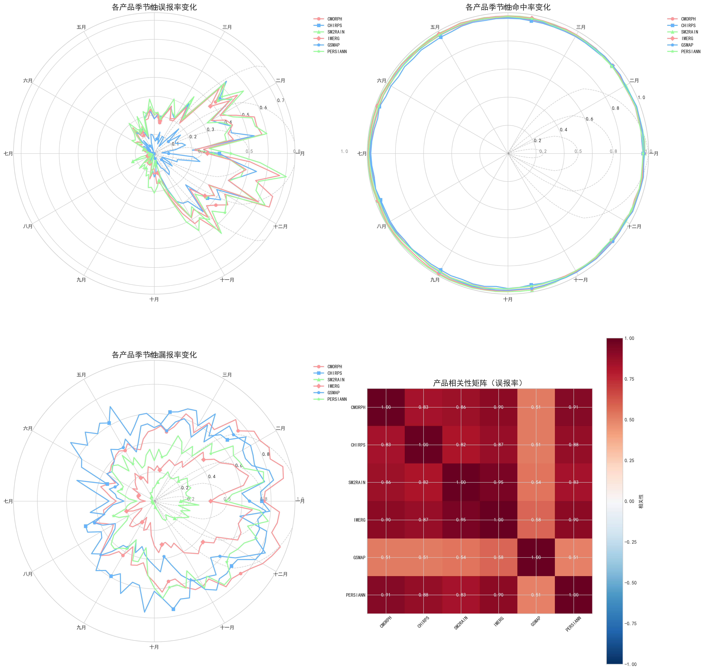
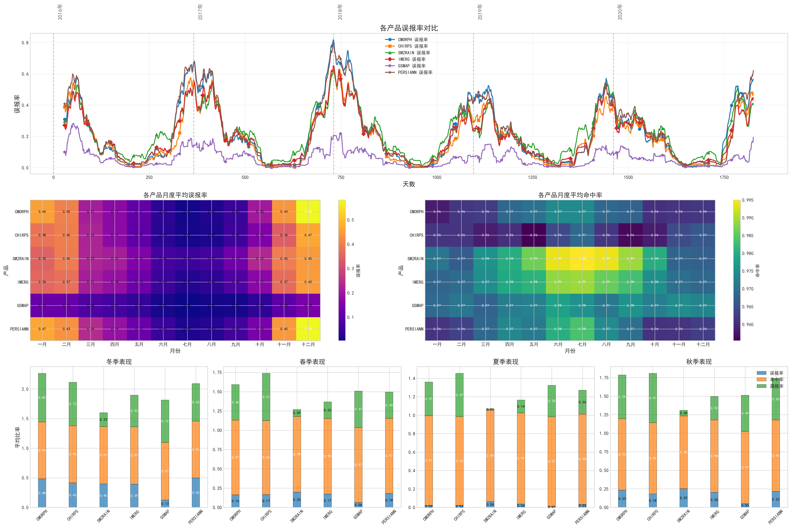
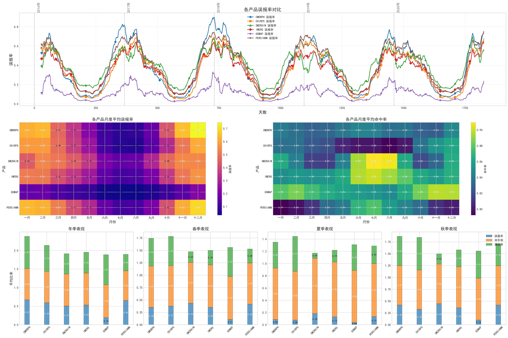

# 技术文档：基于双机器学习模型的多源降雨融合及其在中国东部地区的应用
## 1. 项目研究框架与核心目标

### 1.1 研究背景与挑战

精准、高分辨率的降雨信息是洪水预警、农业精细化管理、水资源优化配置及相关衍生产业（如保险、物流）决策支持不可或缺的关键气象要素。当前，虽然存在多种降雨数据源，例如各类卫星遥感降雨产品（如 CMORPH, CHIRPS, GSMAP, IMERG, PERSIANN, SM2RAIN 等）和地面观测融合数据（如 CHM），但单一数据源在时空连续性、覆盖范围、探测精度以及对特定降雨类型（如小雨、局地强降雨）的捕捉能力上往往存在固有的局限性。直接应用这些原始数据进行预测，常常难以满足日益增长的对高精度、高时效性降雨预报的需求。

**核心挑战**在于：

*   **数据异构性与质量差异：** 不同来源的降雨产品在反演算法、传感器特性、时空分辨率等方面存在显著差异，导致数据质量参差不齐，直接融合与应用难度大。
*   **复杂降雨模式的捕捉：** 降雨是一个高度非线性、多尺度耦合的复杂物理过程，从现有数据中有效提取和表征与降雨生消、强度、时空演变相关的关键模式，是提升预测能力的技术瓶颈。
*   **特定预测难题的攻克：** 对于降雨事件的准确识别（特别是减少误报和漏报）以及对降雨强度的精确量化，一直是降雨预测领域的难点。

### 1.2 项目核心理念与技术路径

为应对上述挑战，本项目提出基于**多源数据深度融合与先进机器学习驱动**的降雨预测研究框架。

**核心理念：**

*   **分而治之，协同增效：** 将复杂的降雨预测问题解构为一系列关联但各有侧重的子任务，针对每个子任务的特性采用最优化的建模策略，并通过有效的融合机制实现整体预测性能的提升。
*   **数据为基，特征为核：** 坚信高质量、多维度的数据是模型性能的基石，而精巧的特征工程是连接数据与模型的桥梁，是洞察降雨规律的关键。
*   **模型驱动，持续优化：** 积极拥抱并探索前沿的机器学习与深度学习技术，通过系统性的模型评估、误差诊断和迭代优化，不断逼近降雨预测的性能上限。

**技术路径规划：**

1.  **多源异构数据规范化与深度整合：**
    *   建立一套稳健的数据获取、清洗、预处理与时空对齐流程，处理包括CMORPH, CHIRPS, GSMAP, IMERG, PERSIANN, SM2RAIN及CHM在内的多种降雨产品，确保数据质量和一致性，为后续分析奠定坚实基础。
    *   探索引入并融合更广泛的多模态信息，如高分辨率数字高程模型（DEM）、土地利用/覆盖数据、以及温度、湿度、风场等相关气象要素，以期更全面地刻画降雨发生的物理环境与潜在驱动因子。
2.  **面向降雨预测的层次化特征工程体系构建：**
    *   设计并实现一个大规模、多维度、可扩展的特征库，深度挖掘多源数据中蕴含的降雨相关信息。特征体系将涵盖：
        *   基础统计特征： 各降雨产品在目标点及邻近区域的原始信息。
        *   多产品协同特征： 量化不同产品间的一致性、差异性与不确定性。
        *   时序动态特征： 捕捉降雨的周期性、记忆性、变化趋势及累积效应。
        *   空间关联特征： 刻画降雨事件的空间展布、梯度与邻域影响。
        *   弱信号与模糊性特征： 增强对小雨、毛毛雨等易忽略事件的感知。
        *   高阶交互与衍生特征： 探索非线性、多因素耦合的复杂降雨模式。
3.  **机器学习与深度学习模型的精细化应用与创新集成：**
    *   **核心任务分解：** 将降雨预测任务初步分解为：
        *   降雨有无分类预测： 重点采用梯度提升树模型（如XGBoost, LightGBM）等判别能力强的机器学习算法，目标是实现高命中率和低误报/漏报率。
        *   降雨强度定量回归预测： 探索应用深度学习模型（如基于CNN的ConvLSTM等），利用其强大的时空特征提取与序列建模能力，进行精细化的降雨量估算。
    *   **针对性误差修正与补丁模型探索：** 针对主分类器在误报（FP）和漏报（FN）事件上的固有难点，研究开发专门的“补丁”模型或对FP/FN样本进行独立建模的策略，以期对主模型的预测结果进行针对性修正和补偿。
    *   **先进集成学习策略：** 系统性研究并应用如Stacking等高级集成学习框架，将不同子任务模型（分类器、回归器、误差修正模型等）的输出作为元特征，训练更高层次的元学习器，以实现对最终降雨预测结果的优化整合与性能提升。
    *   **模型评估与迭代优化：** 建立全面的模型评估体系，不仅关注标准统计指标，更结合气象学专业指标（如POD, FAR, CSI等），并辅以误差诊断、特征重要性分析等手段，驱动特征工程和模型选择的持续迭代。

### 1.3 项目核心价值

本项目致力于通过多源数据融合与先进机器学习技术的深度结合，实现以下核心价值：

*   **提升降雨预测精度与可靠性：** 特别关注提升降雨事件的命中率、降低误报率，并提高临界成功指数，为各类应用提供更可信的降雨信息。
*   **深化对复杂降雨过程的理解：** 通过数据驱动的方式，揭示多源数据中蕴含的复杂降雨模式和关键影响因子。
*   **探索机器学习在气象领域应用的新范式：** 为解决复杂气象预测问题提供一套系统性的方法论参考和可借鉴的技术路径。
*   **积累可复用的技术与知识资产：** 构建模块化的数据处理、特征工程、模型训练与评估代码库，以及相关的技术文档，为后续研究和应用拓展奠定基础。

## 2. 数据体系构建与精细化处理

高质量、规范化的数据是本项目开展多源降雨数据融合与机器学习预测研究的基石。我们构建了涵盖多种主流卫星遥感降雨产品及地面观测融合数据的综合数据体系，并实施了一系列精细化的预处理流程，以确保输入模型的数据质量与一致性。

### 2.1 多源降雨数据概述

本项目核心使用的降雨数据产品包括以下七种卫星遥感产品以及一种作为地面参照的融合分析产品：

1.  **CMORPH (Climate Prediction Center MORPHing technique):**
    *   **描述：** CMORPH是由NOAA气候预测中心（CPC）开发的一种全球高分辨率降雨分析产品。它主要利用低轨道卫星的被动微波观测数据来估计降雨率，并结合地球静止卫星的红外数据，通过“变形”技术来传播和填充微波观测间的降雨特征，从而生成时空连续的降雨场。较新版本的CMORPH（如CDR - Climate Data Record）会进行偏差校正。
    *   **来源：** NOAA/NWS/CPC (美国国家海洋和大气管理局/国家气象局/气候预测中心)。
    *   **本研究使用特点：** 提供较高时空分辨率的降雨估计，是广泛应用的卫星降雨产品之一。

2.  **CHIRPS (Climate Hazards Group InfraRed Precipitation with Station data):**
    *   **描述：** CHIRPS是由美国地质调查局（USGS）和加州大学圣巴巴拉分校气候灾害小组（CHC）合作开发的准全球（50°S-50°N，陆地）高分辨率降雨数据集。它融合了多种数据源，包括其内部的气候学数据（CHPclim）、红外冷云持续时间（CCD）降雨估计以及地面台站观测数据，旨在为干旱监测和趋势分析提供长时间序列的可靠降雨数据。
    *   **来源：** USGS Earth Resources Observation and Science (EROS) Center / University of California, Santa Barbara (UCSB) Climate Hazards Group (CHG)。
    *   **本研究使用特点：** 时间序列长（始于1981年），并融合了地面站点信息，对陆地区域降雨有较好的表征。

3.  **GSMAP (Global Satellite Mapping of Precipitation):**
    *   **描述：** GSMAP是由日本宇宙航空研究开发机构（JAXA）在GPM（全球降雨观测计划）框架下开发的一套全球高分辨率（通常为0.1°，1小时）降雨图产品。它综合利用了GPM核心卫星及其他多颗卫星的微波辐射计和红外传感器数据，通过复杂的算法（包括微波成像仪、微波探测仪和微波红外结合算法）反演降雨。存在近实时版本和经过雨量计校正的再分析版本（如GSMaP_Gauge_RNL）。
    *   **来源：** JAXA (日本宇宙航空研究开发机构)。
    *   **本研究使用特点：** 提供了较高时空分辨率的全球降雨产品，并有多个版本可供选择，其雨量计校正版本通常精度较高。

4.  **IMERG (Integrated Multi-satellitE Retrievals for GPM):**
    *   **描述：** IMERG是NASA在GPM（全球降雨观测计划）框架下的核心多卫星融合降雨产品。它整合了GPM星座中所有卫星的微波降雨估计、地球静止卫星的红外数据以及月平均的地面雨量计数据（用于Final Run产品的校正），旨在提供覆盖全球大部分区域的高精度、高时空分辨率（通常为0.1°，半小时）的降雨数据。IMERG产品有Early, Late, 和 Final Run三个版本，延迟和精度依次增加。
    *   **来源：** NASA (美国国家航空航天局) Goddard Earth Sciences Data and Information Services Center (GES DISC)。
    *   **本研究使用特点：** 作为GPM时代的主力产品，综合了多源信息，被广泛认为是当前最先进的全球卫星降雨产品之一，特别是其Final Run版本。

5.  **PERSIANN (Precipitation Estimation from Remotely Sensed Information using Artificial Neural Networks):**
    *   **描述：** PERSIANN是由加州大学欧文分校水文气象与遥感中心（CHRS）开发的一系列基于人工智能（神经网络）的卫星降雨反演算法和产品。它主要利用地球静止卫星的红外（IR）数据，通过神经网络模型建立云顶亮温与降雨率之间的关系，并通常利用低轨道卫星的被动微波数据进行校准。PERSIANN-CDR (Climate Data Record) 是其一个提供长期（1983年至今）、0.25°日降雨估计的气候数据集，并使用GPCP月产品进行调整。
    *   **来源：** University of California, Irvine - Center for Hydrometeorology and Remote Sensing (CHRS)。
    *   **本研究使用特点：** 拥有非常长的时间序列，并应用了机器学习方法进行降雨反演。

6.  **SM2RAIN (Soil Moisture to Rainfall):**
    *   **描述：** SM2RAIN是一种独特的“自下而上”的降雨估计算法和产品系列。它基于土壤水平衡原理，利用卫星观测的土壤湿度变化来反演降雨量。其核心思想是将土壤视为一个天然的雨量计。SM2RAIN算法已应用于多种卫星土壤湿度产品（如ASCAT, SMOS, SMAP等）以生成全球或区域降雨数据集。
    *   **来源：** 该算法由意大利国家研究委员会水文地质保护研究所（CNR-IRPI）的研究人员首先提出并发展，相关数据集（如SM2RAIN-ASCAT）可通过Zenodo等平台获取。
    *   **本研究使用特点：** 提供了一个与其他基于云物理特性反演的卫星产品完全独立的降雨估计源，可能在数据融合中提供独特的补充信息。

7.  **CHM (China's High-resolution Meteorological product) - (作为地面参照):**
    *   **描述：** CHM通常指代一系列针对中国区域的高分辨率气象数据产品。在降雨方面，如CHM_PRE（China Hydro-Meteorology dataset - Precipitation）是一个基于中国大陆稠密地面雨量计观测数据，通过优化的插值方案（如考虑地形影响的PRISM模型与反距离加权等结合）构建的格点化日降雨数据集。它旨在为水文、气候及数值模型研究提供高质量的地面降雨基准。
    *   **来源：** 通常由中国科研机构或气象部门主导开发，例如，提及的CHM_PRE数据集的构建涉及到对中国气象局提供的约2400至2800多个地面台站数据的处理。
    *   **本研究使用特点：** 作为评估卫星降雨产品性能以及机器学习模型预测结果的“地面真值”或参照标准。

上述产品的时间跨度覆盖了 **2016年至2020年**，为模型训练和评估提供了多年的连续观测。原始数据格式多样（如NetCDF `.nc`, GRIB, HDF, `.zip`压缩包等）

### 2.2 关键预处理技术详解

为有效整合这些异构数据并服务于后续的特征工程与模型构建，我们设计并实施了以下关键预处理步骤：

1.  **数据读取与初步解析 (参考 `src/readdata/` 目录下脚本)：**
    *   针对每种降雨产品的原始数据格式，开发了专门的读取脚本（如`CMORPH.py`, `CHIRPS.py`等），利用如 `xarray`, `netCDF4`, `h5py` 等Python库，准确提取降雨率、累计降雨量等核心变量，并解析时间和空间坐标信息。
    *   对原始数据进行初步的时间筛选，确保所有产品的时间范围对齐至研究时段（2016-2020年）。

2.  **时空对齐与分辨率统一 (核心处理位于 `src/readdata/scale_utils.py` 及各产品处理脚本中)：**
    *   **目标网格：** 将所有降雨产品统一到中国区域 **0.25°经纬度等间隔格网，时间分辨率统一为逐日（Daily）**。
    *   **空间插值/重采样：** 采用**双线性插值 (Bilinear Interpolation)** 方法作为主要的二维空间插值技术，将不同原始分辨率的卫星格点数据重采样至目标0.25°网格。选择双线性插值是因为其在保持数据平滑性和计算效率之间取得了较好的平衡。对于某些特定产品或研究阶段，也可能探索过其他插值方法（如最近邻、三次样条等）并进行了比较。
    *   **时间聚合/分配：** 对于原始时间分辨率高于逐日的产品（如部分产品提供3小时或逐小时数据），通过累加的方式聚合为日总降雨量。对于原始时间分辨率低于逐日的情况（较少见于主流产品），则需考虑更复杂的降尺度或分配方法（本项目主要处理的是原始分辨率等于或高于目标分辨率的情况）。

3.  **地理空间掩码处理与区域数据提取：**
    *   **掩码生成：** 基于高精度地理信息数据，使用GDAL和geopandans地理数据库将矢量边界数据处理成覆盖中国大陆及主要流域（如长江流域）的0.25°分辨率地理掩码文件（存储于 `data/mask/`，如 `chinamask.mat`, `yangzemask.mat`）。掩码文件中，特定值（如1）标识中国大陆范围，更高值（如2）标识长江流域范围，0或其他值标识研究区域外。
    *   **数据裁剪：** 在完成时空对齐后，利用生成的掩码，精确提取出研究区域（全国范围或长江流域）内的有效降雨数据。非研究区域的格点值被赋予NaN（Not a Number）标记。这一步骤确保了后续分析和建模仅针对目标区域进行，避免了无关数据的干扰。

4.  **缺失值（NaN）处理策略 (参考 `src/readdata/datafix.py` 及相关逻辑)：**
    *   原始卫星降雨产品及插值过程中可能产生缺失值。针对这些NaN值，我们实施了系统的、多阶段的填充策略，以最大限度保证数据的完整性和质量：
        *   **初步阈值填充：** 对于某些产品中明确指示为“无雨”但标记为特殊负值或极大值的像元，首先将其统一为0或NaN。
        *   **时空邻近插值：**
            *   **空间插值：** 优先考虑利用格点周围有效邻居的均值或中位数进行插值。
            *   **时间插值：** 若空间插值后仍有缺失，则考虑利用该格点前后邻近有效天数的均值或线性插值进行填充。
        *   **多产品协同参考（可选探索）：** 对于某些难以通过单一产品时空信息填充的顽固NaN点，曾探索过参考同一时空位置其他可靠产品的数值进行辅助填充的策略。
        *   **最终阈值替换：** 经过上述插值后，若仍存在少量孤立NaN点，且根据上下文判断其最可能为无雨状态，则可能采用特定阈值（如0）进行最终替换。
    *   **目标：** 尽可能恢复真实降雨信息，同时避免引入不合理的估计值。所有NaN处理步骤都经过审慎评估，并记录处理前后的数据差异。

5.  **数据标准化与格式统一：**
    *   **单位统一：** 确保所有降雨数据统一使用毫米/天 (mm/day) 作为单位。
    *   **数据结构与存储：** 经过上述所有预处理流程后，每种降雨产品针对特定区域（如全国或长江流域）的数据，被组织成统一的维度结构（例如，时间 × 纬度 × 经度，或展平后的 时间 × 格点数），并以 `.mat` 文件格式存储于 `data/intermediate/` 目录下，按产品和年份（或多年合并）分别存放。例如 `CMORPH_2016_2020.mat`。这种格式便于后续在MATLAB或Python (通过`scipy.io.loadmat`) 中高效读取和处理。

通过上述精细化的数据预处理流程，我们获得了高质量、时空一致、格式统一的多源降雨数据集，为后续的特征工程和机器学习建模奠定了坚实的数据基础。对原始数据质量的深入理解和细致处理，是提升最终降雨预测产品性能的关键第一步。

### 2.3 预处理后数据的初步探索与基线性能评估

在完成对多源降雨数据的规范化和精细化预处理之后，我们对这些直接可用的数据产品（CMORPH, CHIRPS, GSMAP, IMERG, PERSIANN, SM2RAIN）以及作为参照真值的CHM产品，在重点研究区域（长江流域）和全国范围内进行了系统的初步性能评估和统计特征分析。这一步骤旨在：

1.  深入理解各数据产品在不同降雨强度阈值下的表现特性，包括其固有的优势与不足。
2.  量化产品间的相关性与差异性。
3.  识别数据中可能存在的系统性偏差或特定模式（如误报的空间聚集性）。
4.  为后续的特征工程设计（如选择哪些产品作为核心信息源、如何针对特定产品的弱点设计补偿特征）和模型性能评估（建立基准线）提供数据驱动的依据。

#### 2.3.1 长江流域多源降雨产品性能评估 

我们首先聚焦于长江流域，评估了六种主流卫星降雨产品在2016-2020年期间，相对于CHM地面观测融合数据的分类性能。评估采用了一系列常用的气象评估指标，包括命中率 (POD - Probability of Detection)、空报率 (FAR - False Alarm Ratio) 和临界成功指数 (CSI - Critical Success Index)，并在多个不同的降雨量分类阈值（从0.00 mm/d 到 0.95 mm/d）下进行。

**核心发现概述：**

*   **不同产品在不同指标和阈值下表现各异：** 没有单一产品在所有情况下都表现最优。
*   **SM2RAIN在POD上表现突出：** 特别是在判断“有无降雨”方面，其命中率通常最高。
*   **GSMAP在FAR控制上表现优异：** 其误报率在所有产品中通常是最低的。
*   **IMERG综合性能较好：** 在POD、FAR、CSI等多个指标上表现相对均衡且稳健。
*   **阈值依赖性：** 各产品的性能指标对降雨分类阈值的选择表现出不同程度的敏感性。
*   **时间性依赖性** 各个产品具有不同和相同特征, 各产品的性能指标在不同时间尺度下都有非常明显的周期性特征

*   **时间性规律：**
        FP/FN的季节性和月度规律（如果显著且稳定）可以作为先验知识融入特征工程或模型构建中。例如，可以构建季节性交互特征，或者在特定易发生FP/FN的月份调整模型的敏感度或后处理策略。
        年际间的性能差异提示我们，在进行模型训练和评估时，需要充分考虑不同年份数据可能带来的影响，确保模型的泛化能力。
*   **降雨强度依赖性：**
        漏报主要集中在小雨和微雨： 这强烈表明，提升对弱降水事件的探测能力是减少漏报的关键。特征工程中设计的“弱信号增强特征”正是针对这一问题。未来模型可能需要专门针对小雨训练优化模块，或者在损失函数中赋予小雨事件更高的权重。
        误报也主要表现为预测出小雨： 这意味着，虽然我们希望减少误报，但也需要注意不要过度抑制模型对真实小雨的预测。关键在于区分“真实的小雨”和“被错误当成小雨的无雨情况”。

**详细数据表格：**

##### 表1: 各产品在不同阈值下的 POD (命中率)

| 阈值   | CMORPH | CHIRPS | GSMAP  | IMERG  | PERSIANN | SM2RAIN |
|------|--------|--------|--------|--------|----------|---------|
| 0.00 | 0.4919 | 0.4113 | 0.5557 | 0.7515 | 0.6004   | 0.9153  |
| 0.05 | 0.5243 | 0.4280 | 0.5887 | 0.7227 | 0.6235   | 0.9074  |
| 0.10 | 0.5460 | 0.4383 | 0.6085 | 0.7053 | 0.6368   | 0.9030  |
| 0.15 | 0.5281 | 0.4441 | 0.6216 | 0.6933 | 0.6449   | 0.8973  |
| 0.20 | 0.5401 | 0.4470 | 0.6317 | 0.6841 | 0.6507   | 0.8946  |
| 0.25 | 0.5285 | 0.4487 | 0.6403 | 0.6767 | 0.6552   | 0.8914  |
| 0.30 | 0.5372 | 0.4497 | 0.6471 | 0.6700 | 0.6584   | 0.8894  |
| 0.35 | 0.5256 | 0.4509 | 0.6533 | 0.6645 | 0.6606   | 0.8870  |
| 0.40 | 0.5327 | 0.4517 | 0.6585 | 0.6593 | 0.6617   | 0.8852  |
| 0.45 | 0.5231 | 0.4522 | 0.6630 | 0.6548 | 0.6619   | 0.8831  |
| 0.50 | 0.5148 | 0.4525 | 0.6669 | 0.6506 | 0.6612   | 0.8809  |
| 0.55 | 0.5204 | 0.4528 | 0.6704 | 0.6466 | 0.6598   | 0.8793  |
| 0.60 | 0.5258 | 0.4530 | 0.6735 | 0.6429 | 0.6580   | 0.8776  |
| 0.65 | 0.5166 | 0.4532 | 0.6764 | 0.6394 | 0.6559   | 0.8758  |
| 0.70 | 0.5109 | 0.4534 | 0.6790 | 0.6361 | 0.6538   | 0.8739  |
| 0.75 | 0.5156 | 0.4536 | 0.6813 | 0.6329 | 0.6515   | 0.8724  |
| 0.80 | 0.5199 | 0.4537 | 0.6833 | 0.6300 | 0.6491   | 0.8710  |
| 0.85 | 0.5122 | 0.4538 | 0.6853 | 0.6273 | 0.6466   | 0.8691  |
| 0.90 | 0.5162 | 0.4538 | 0.6870 | 0.6245 | 0.6441   | 0.8674  |
| 0.95 | 0.5109 | 0.4539 | 0.6885 | 0.6218 | 0.6416   | 0.8659  |

##### 表2: 各产品在不同阈值下的 FAR (空报率)

| 阈值   | CMORPH | CHIRPS | GSMAP  | IMERG  | PERSIANN | SM2RAIN |
|------|--------|--------|--------|--------|----------|---------|
| 0.00 | 0.1173 | 0.1246 | 0.0250 | 0.1425 | 0.1602   | 0.2076  |
| 0.05 | 0.1607 | 0.1672 | 0.0454 | 0.1766 | 0.2145   | 0.2716  |
| 0.10 | 0.1905 | 0.1935 | 0.0613 | 0.1947 | 0.2467   | 0.3088  |
| 0.15 | 0.1977 | 0.2105 | 0.0734 | 0.2061 | 0.2676   | 0.3316  |
| 0.20 | 0.2144 | 0.2240 | 0.0837 | 0.2145 | 0.2831   | 0.3494  |
| 0.25 | 0.2187 | 0.2352 | 0.0931 | 0.2215 | 0.2960   | 0.3631  |
| 0.30 | 0.2311 | 0.2452 | 0.1014 | 0.2273 | 0.3067   | 0.3747  |
| 0.35 | 0.2332 | 0.2543 | 0.1091 | 0.2326 | 0.3165   | 0.3845  |
| 0.40 | 0.2435 | 0.2625 | 0.1162 | 0.2374 | 0.3249   | 0.3932  |
| 0.45 | 0.2449 | 0.2703 | 0.1231 | 0.2419 | 0.3327   | 0.4006  |
| 0.50 | 0.2464 | 0.2774 | 0.1296 | 0.2462 | 0.3397   | 0.4071  |
| 0.55 | 0.2546 | 0.2841 | 0.1357 | 0.2501 | 0.3460   | 0.4132  |
| 0.60 | 0.2625 | 0.2905 | 0.1416 | 0.2540 | 0.3519   | 0.4188  |
| 0.65 | 0.2628 | 0.2967 | 0.1472 | 0.2576 | 0.3574   | 0.4235  |
| 0.70 | 0.2646 | 0.3028 | 0.1528 | 0.2613 | 0.3627   | 0.4280  |
| 0.75 | 0.2714 | 0.3083 | 0.1580 | 0.2648 | 0.3675   | 0.4322  |
| 0.80 | 0.2779 | 0.3136 | 0.1630 | 0.2681 | 0.3719   | 0.4361  |
| 0.85 | 0.2778 | 0.3189 | 0.1678 | 0.2712 | 0.3763   | 0.4394  |
| 0.90 | 0.2842 | 0.3241 | 0.1726 | 0.2746 | 0.3805   | 0.4426  |
| 0.95 | 0.2856 | 0.3290 | 0.1773 | 0.2777 | 0.3845   | 0.4457  |

##### 表3: 各产品在不同阈值下的 CSI (临界成功指数)

| 阈值   | CMORPH | CHIRPS | GSMAP  | IMERG  | PERSIANN | SM2RAIN |
|------|--------|--------|--------|--------|----------|---------|
| 0.00 | 0.4617 | 0.3885 | 0.5479 | 0.6681 | 0.5387   | 0.7382  |
| 0.05 | 0.4765 | 0.3941 | 0.5727 | 0.6257 | 0.5328   | 0.6780  |
| 0.10 | 0.4838 | 0.3966 | 0.5852 | 0.6025 | 0.5269   | 0.6434  |
| 0.15 | 0.4673 | 0.3971 | 0.5924 | 0.5875 | 0.5219   | 0.6208  |
| 0.20 | 0.4707 | 0.3960 | 0.5973 | 0.5764 | 0.5176   | 0.6043  |
| 0.25 | 0.4604 | 0.3943 | 0.6008 | 0.5674 | 0.5137   | 0.5910  |
| 0.30 | 0.4625 | 0.3924 | 0.6031 | 0.5597 | 0.5099   | 0.5802  |
| 0.35 | 0.4532 | 0.3908 | 0.6049 | 0.5531 | 0.5058   | 0.5708  |
| 0.40 | 0.4548 | 0.3892 | 0.6061 | 0.5470 | 0.5019   | 0.5625  |
| 0.45 | 0.4472 | 0.3873 | 0.6065 | 0.5416 | 0.4976   | 0.5553  |
| 0.50 | 0.4406 | 0.3856 | 0.6067 | 0.5366 | 0.4934   | 0.5489  |
| 0.55 | 0.4419 | 0.3839 | 0.6065 | 0.5319 | 0.4891   | 0.5431  |
| 0.60 | 0.4429 | 0.3821 | 0.6062 | 0.5274 | 0.4848   | 0.5376  |
| 0.65 | 0.4363 | 0.3804 | 0.6057 | 0.5233 | 0.4806   | 0.5329  |
| 0.70 | 0.4316 | 0.3788 | 0.6049 | 0.5192 | 0.4765   | 0.5284  |
| 0.75 | 0.4325 | 0.3773 | 0.6040 | 0.5154 | 0.4726   | 0.5242  |
| 0.80 | 0.4332 | 0.3758 | 0.6031 | 0.5119 | 0.4689   | 0.5204  |
| 0.85 | 0.4279 | 0.3743 | 0.6021 | 0.5086 | 0.4652   | 0.5170  |
| 0.90 | 0.4284 | 0.3727 | 0.6009 | 0.5051 | 0.4615   | 0.5137  |
| 0.95 | 0.4243 | 0.3713 | 0.5995 | 0.5019 | 0.4580   | 0.5105  |

**初步解读与启示：**

通过这些表格数据，我们可以清晰地看到，例如，在0.1 mm/d的常用“有雨”判断阈值下，各产品的POD、FAR、CSI值。这些基线数据为后续机器学习模型通过特征工程和算法优化所能达到的性能提升提供了一个明确的参照。例如，模型融合的目标之一就是结合GSMAP的低FAR特性和SM2RAIN或IMERG的高POD特性，以期获得更高的CSI。

#### 2.3.2 长江流域各降雨产品基本统计特征分析

除了分类性能指标，我们还分析了各降雨产品在长江流域（2016-2020年）的基本统计特征，包括均值、标准差、最大/小值、中位数、众数、方差、偏度、峰度，以及它们与CHM真值和其他产品之间的相关系数。

**核心发现概述：**

*   **数值分布差异显著：** 不同产品的平均降雨量、变异程度（标准差、方差）、极值分布以及分布形态（偏度、峰度）均存在明显差异。例如，SM2RAIN的中位数显著高于其他产品，表明其对小雨事件的记录更为频繁。
*   **与CHM的相关性：** 各产品与CHM的相关性各不相同，GSMAP和SM2RAIN通常表现出较高的相关性，而CHIRPS和PERSIANN相对较低。这为选择在模型中赋予不同产品何种初始“信任度”提供了参考。
*   **产品间相关性：** 产品间的相关性矩阵揭示了哪些产品在描述降雨过程上更为相似（如IMERG与CMORPH、PERSIANN之间通常有较高相关性），哪些产品可能提供更独立的信息（如SM2RAIN与其他产品的相关性模式）。

**详细数据表格：**

以下数据基于长江流域范围（掩码值为2的区域），时间跨度为2016-2020年。

| 指标                                   | CMORPH                 | CHIRPS                 | SM2RAIN                | IMERG                  | GSMAP                  | PERSIANN               |
|----------------------------------------|------------------------|------------------------|------------------------|------------------------|------------------------|------------------------|
| 平均值                                 | 3.3629                 | 3.5047                 | 3.9431                 | 3.5663                 | 3.2589                 | 3.5872                 |
| 标准差                                 | 9.9921                 | 9.8690                 | 5.4609                 | 9.7228                 | 7.9307                 | 8.1056                 |
| 最大值                                 | 379.8000               | 330.5150               | 228.4960               | 357.1993               | 280.7053               | 230.6858               |
| 最小值                                 | 0.0000                 | 0.0000                 | 0.0000                 | 0.0000                 | 0.0000                 | 0.0000                 |
| 中位数                                 | 0.0000                 | 0.0000                 | 1.9240                 | 0.1765                 | 0.0000                 | 0.2830                 |
| 众数 (count)                           | 0.0000 (3103372)       | 0.0000 (3453450)       | 0.0000 (709395)        | 0.0000 (1825289)       | 0.0000 (3052396)       | 0.0000 (2472006)       |
| 方差                                   | 99.8425                | 97.3975                | 29.8218                | 94.5334                | 62.8952                | 65.7014                |
| 偏度 (Skewness)                        | 6.1082                 | 5.5473                 | 3.0639                 | 5.9726                 | 4.9681                 | 4.7259                 |
| 峰度 (Kurtosis)                        | 57.8855                | 50.6663                | 21.6656                | 55.5745                | 40.8976                | 34.8649                |
| 和地面观测站(CHM)之间的相关系数        | 0.4456                 | 0.3900                 | 0.5695                 | 0.5014                 | 0.6454                 | 0.4133                 |
| 和 CMORPH 之间的相关系数               | 1.0000 (self-correlation) | 0.6147                 | 0.5000                 | 0.8259                 | 0.6593                 | 0.6752                 |
| 和 CHIRPS 之间的相关系数               | 0.6147                 | 1.0000 (self-correlation) | 0.4278                 | 0.6541                 | 0.5802                 | 0.7533                 |
| 和 SM2RAIN 之间的相关系数              | 0.5000                 | 0.4278                 | 1.0000 (self-correlation) | 0.5359                 | 0.6233                 | 0.4636                 |
| 和 IMERG 之间的相关系数                | 0.8259                 | 0.6541                 | 0.5359                 | 1.0000 (self-correlation) | 0.7261                 | 0.7134                 |
| 和 GSMAP 之间的相关系数                | 0.6593                 | 0.5802                 | 0.6233                 | 0.7261                 | 1.0000 (self-correlation) | 0.5920                 |
| 和 PERSIANN 之间的相关系数             | 0.6752                 | 0.7533                 | 0.4636                 | 0.7134                 | 0.5920                 | 1.0000 (self-correlation) |

// ... existing code ...
| 和 PERSIANN 之间的相关系数         | 0.6551                 | 0.7431                 | 0.5092                 | 0.7137                 | 0.5990                 | 1.0000 (self-correlation) |

**初步解读与启示：**

这些统计特征为理解各产品的数据特性提供了量化依据。例如，高偏度和高峰度的产品可能意味着其降雨数据中存在较多极端值或大量零值。产品间的相关性分析有助于在特征工程中避免引入过多冗余信息，并指导如何组合不同产品以获取更全面的降雨描述。

#### 2.3.3 全国范围多源降雨产品性能评估与统计特征 (补充与对比)

为了更全面地理解产品性能的空间普适性和区域差异性，我们也在全国范围内进行了类似的性能评估和统计特征分析。

**核心发现概述（与长江流域对比）：**

*   **总体趋势相似但数值有差异：** 全国范围的评估结果在产品间的相对优劣势上与长江流域的发现大体一致，但具体的POD, FAR, CSI数值以及统计特征参数会因气候区域、降雨类型的不同而有所差异。
*   **空间异质性的体现：** 对比全国和长江流域的结果，可以初步感知到产品性能的空间异质性。例如，某些产品在湿润的长江流域表现较好，但在干旱/半干旱的北方地区性能可能会下降。

**详细数据表格：**

##### 表4: 全国范围各产品在不同阈值下的 POD (命中率)

| 阈值   | CMORPH | CHIRPS | GSMAP  | IMERG  | PERSIANN | SM2RAIN |
|------|--------|--------|--------|--------|----------|---------|
| 0.00 | 0.4474 | 0.3849 | 0.4636 | 0.7002 | 0.6594   | 0.7931  |
| 0.05 | 0.4871 | 0.3995 | 0.5097 | 0.6694 | 0.6740   | 0.7845  |
| 0.10 | 0.5124 | 0.4079 | 0.5366 | 0.6532 | 0.6787   | 0.7780  |
| 0.15 | 0.4917 | 0.4125 | 0.5539 | 0.6424 | 0.6798   | 0.7693  |
| 0.20 | 0.5052 | 0.4148 | 0.5670 | 0.6344 | 0.6793   | 0.7665  |
| 0.25 | 0.4925 | 0.4162 | 0.5776 | 0.6278 | 0.6781   | 0.7630  |
| 0.30 | 0.5021 | 0.4170 | 0.5861 | 0.6221 | 0.6762   | 0.7616  |
| 0.35 | 0.4896 | 0.4179 | 0.5936 | 0.6173 | 0.6738   | 0.7595  |
| 0.40 | 0.4973 | 0.4185 | 0.5999 | 0.6128 | 0.6708   | 0.7585  |
| 0.45 | 0.4869 | 0.4189 | 0.6055 | 0.6089 | 0.6674   | 0.7569  |
| 0.50 | 0.4780 | 0.4191 | 0.6103 | 0.6052 | 0.6636   | 0.7554  |
| 0.55 | 0.4840 | 0.4193 | 0.6146 | 0.6017 | 0.6595   | 0.7547  |
| 0.60 | 0.4897 | 0.4195 | 0.6185 | 0.5985 | 0.6553   | 0.7541  |
| 0.65 | 0.4803 | 0.4197 | 0.6221 | 0.5955 | 0.6512   | 0.7529  |
| 0.70 | 0.4743 | 0.4199 | 0.6254 | 0.5927 | 0.6472   | 0.7518  |
| 0.75 | 0.4792 | 0.4201 | 0.6283 | 0.5900 | 0.6432   | 0.7513  |
| 0.80 | 0.4838 | 0.4201 | 0.6309 | 0.5875 | 0.6393   | 0.7507  |
| 0.85 | 0.4757 | 0.4202 | 0.6334 | 0.5851 | 0.6354   | 0.7496  |
| 0.90 | 0.4800 | 0.4203 | 0.6357 | 0.5828 | 0.6316   | 0.7488  |
| 0.95 | 0.4746 | 0.4203 | 0.6377 | 0.5805 | 0.6279   | 0.7481  |

##### 表5: 全国范围各产品在不同阈值下的 FAR (空报率)

| 阈值   | CMORPH | CHIRPS | GSMAP  | IMERG  | PERSIANN | SM2RAIN |
|------|--------|--------|--------|--------|----------|---------|
| 0.00 | 0.2750 | 0.3085 | 0.0615 | 0.2850 | 0.3816   | 0.3519  |
| 0.05 | 0.3360 | 0.3551 | 0.0885 | 0.3116 | 0.4382   | 0.4127  |
| 0.10 | 0.3742 | 0.3766 | 0.1080 | 0.3244 | 0.4601   | 0.4387  |
| 0.15 | 0.3747 | 0.3881 | 0.1222 | 0.3318 | 0.4706   | 0.4456  |
| 0.20 | 0.3943 | 0.3962 | 0.1340 | 0.3371 | 0.4769   | 0.4537  |
| 0.25 | 0.3943 | 0.4026 | 0.1443 | 0.3418 | 0.4812   | 0.4577  |
| 0.30 | 0.4082 | 0.4080 | 0.1533 | 0.3456 | 0.4842   | 0.4619  |
| 0.35 | 0.4059 | 0.4127 | 0.1615 | 0.3491 | 0.4867   | 0.4643  |
| 0.40 | 0.4170 | 0.4168 | 0.1689 | 0.3522 | 0.4887   | 0.4672  |
| 0.45 | 0.4145 | 0.4208 | 0.1758 | 0.3553 | 0.4905   | 0.4689  |
| 0.50 | 0.4127 | 0.4245 | 0.1823 | 0.3581 | 0.4921   | 0.4703  |
| 0.55 | 0.4214 | 0.4278 | 0.1882 | 0.3607 | 0.4935   | 0.4723  |
| 0.60 | 0.4297 | 0.4312 | 0.1940 | 0.3634 | 0.4949   | 0.4741  |
| 0.65 | 0.4265 | 0.4343 | 0.1995 | 0.3661 | 0.4962   | 0.4751  |
| 0.70 | 0.4258 | 0.4375 | 0.2047 | 0.3686 | 0.4976   | 0.4762  |
| 0.75 | 0.4329 | 0.4405 | 0.2098 | 0.3711 | 0.4989   | 0.4777  |
| 0.80 | 0.4396 | 0.4433 | 0.2145 | 0.3734 | 0.5000   | 0.4790  |
| 0.85 | 0.4366 | 0.4462 | 0.2191 | 0.3757 | 0.5011   | 0.4798  |
| 0.90 | 0.4429 | 0.4490 | 0.2236 | 0.3779 | 0.5024   | 0.4807  |
| 0.95 | 0.4421 | 0.4517 | 0.2279 | 0.3802 | 0.5035   | 0.4817  |

##### 表6: 全国范围各产品在不同阈值下的 CSI (临界成功指数)

| 阈值   | CMORPH | CHIRPS | GSMAP  | IMERG  | PERSIANN | SM2RAIN |
|------|--------|--------|--------|--------|----------|---------|
| 0.00 | 0.3825 | 0.3285 | 0.4499 | 0.5474 | 0.4687   | 0.5544  |
| 0.05 | 0.3908 | 0.3275 | 0.4856 | 0.5138 | 0.4417   | 0.5057  |
| 0.10 | 0.3922 | 0.3273 | 0.5039 | 0.4973 | 0.4300   | 0.4838  |
| 0.15 | 0.3798 | 0.3270 | 0.5142 | 0.4871 | 0.4237   | 0.4753  |
| 0.20 | 0.3802 | 0.3261 | 0.5213 | 0.4796 | 0.4195   | 0.4684  |
| 0.25 | 0.3729 | 0.3250 | 0.5264 | 0.4735 | 0.4163   | 0.4641  |
| 0.30 | 0.3730 | 0.3239 | 0.5299 | 0.4683 | 0.4136   | 0.4605  |
| 0.35 | 0.3669 | 0.3231 | 0.5327 | 0.4638 | 0.4111   | 0.4580  |
| 0.40 | 0.3668 | 0.3221 | 0.5348 | 0.4596 | 0.4088   | 0.4555  |
| 0.45 | 0.3621 | 0.3211 | 0.5362 | 0.4559 | 0.4063   | 0.4537  |
| 0.50 | 0.3578 | 0.3201 | 0.5372 | 0.4524 | 0.4039   | 0.4521  |
| 0.55 | 0.3579 | 0.3192 | 0.5379 | 0.4492 | 0.4015   | 0.4505  |
| 0.60 | 0.3577 | 0.3183 | 0.5384 | 0.4461 | 0.3991   | 0.4489  |
| 0.65 | 0.3539 | 0.3174 | 0.5386 | 0.4431 | 0.3967   | 0.4478  |
| 0.70 | 0.3509 | 0.3165 | 0.5387 | 0.4403 | 0.3944   | 0.4466  |
| 0.75 | 0.3508 | 0.3157 | 0.5385 | 0.4377 | 0.3921   | 0.4453  |
| 0.80 | 0.3507 | 0.3148 | 0.5382 | 0.4352 | 0.3900   | 0.4442  |
| 0.85 | 0.3476 | 0.3140 | 0.5378 | 0.4327 | 0.3878   | 0.4432  |
| 0.90 | 0.3474 | 0.3130 | 0.5373 | 0.4304 | 0.3857   | 0.4423  |
| 0.95 | 0.3449 | 0.3122 | 0.5367 | 0.4281 | 0.3836   | 0.4412  |

| 和 PERSIANN 之间的相关系数             | 0.6752                 | 0.7533                 | 0.4636                 | 0.7134                 | 0.5920                 | 1.0000 (self-correlation) |

以下数据基于全国范围（掩码值为1的区域），时间跨度为2016-2020年 (1827天)。目标变量 Y 为 CHM 产品。

| 指标                               | CMORPH                 | CHIRPS                 | SM2RAIN                | IMERG                  | GSMAP                  | PERSIANN               |
|------------------------------------|------------------------|------------------------|------------------------|------------------------|------------------------|------------------------|
| 平均值                             | 1.8652                 | 1.8549                 | 1.9931                 | 1.8931                 | 1.6654                 | 1.9591                 |
| 标准差                             | 6.9623                 | 6.9233                 | 4.2815                 | 6.7717                 | 5.7024                 | 5.5107                 |
| 最大值                             | 379.8000               | 330.5150               | 301.2768               | 408.9030               | 297.9254               | 281.0631               |
| 最小值                             | 0.0000                 | 0.0000                 | 0.0000                 | 0.0000                 | 0.0000                 | 0.0000                 |
| 中位数                             | 0.0000                 | 0.0000                 | 0.2000                 | 0.0194                 | 0.0000                 | 0.1256                 |
| 众数 (count)                       | 0.0000 (18647303)      | 0.0000 (19567263)      | 0.0000 (9411016)       | 0.0000 (13131758)      | 0.0000 (20520991)      | 0.0000 (11810182)      |
| 方差                               | 48.4740                | 47.9320                | 18.3316                | 45.8562                | 32.5170                | 30.3680                |
| 偏度 (Skewness)                    | 8.2594                 | 7.7101                 | 4.6727                 | 8.5174                 | 7.4365                 | 6.6837                 |
| 峰度 (Kurtosis)                    | 108.5944               | 96.0344                | 46.5308                | 119.3158               | 96.1135                | 72.6359                |
| 和 Y (CHM) 之间的相关系数         | 0.4407                 | 0.4124                 | 0.5743                 | 0.5204                 | 0.6591                 | 0.4416                 |
| 和 CMORPH 之间的相关系数           | 1.0000 (self-correlation) | 0.6000                 | 0.5021                 | 0.7943                 | 0.6313                 | 0.6551                 |
| 和 CHIRPS 之间的相关系数           | 0.6000                 | 1.0000 (self-correlation) | 0.4650                 | 0.6605                 | 0.5851                 | 0.7431                 |
| 和 SM2RAIN 之间的相关系数          | 0.5021                 | 0.4650                 | 1.0000 (self-correlation) | 0.5690                 | 0.6298                 | 0.5092                 |
| 和 IMERG 之间的相关系数            | 0.7943                 | 0.6605                 | 0.5690                 | 1.0000 (self-correlation) | 0.7326                 | 0.7137                 |
| 和 GSMAP 之间的相关系数            | 0.6313                 | 0.5851                 | 0.6298                 | 0.7326                 | 1.0000 (self-correlation) | 0.5990                 |
| 和 PERSIANN 之间的相关系数         | 0.6551                 | 0.7431                 | 0.5092                 | 0.7137                 | 0.5990                 | 1.0000 (self-correlation) |

**初步解读与启示：**

全国范围的数据分析为我们理解产品在更广阔空间尺度上的行为提供了视角，并强调了在进行模型构建和应用时考虑区域适应性的重要性。这些数据也为后续可能开展的全国范围降雨预测或分区建模研究提供了基础。

#### 2.3.4 各降雨产品逐年性能指标的空间统计特征详析 (初步洞察)

为进一步深入理解产品性能的时空变异性及其对模型构建的潜在影响，我们对各主要降雨产品（CMORPH, CHIRPS, GSMAP, IMERG, PERSIANN, SM2RAIN）在2016年至2020年间，**逐年、逐不同降雨分类阈值**下的POD, FAR, CSI等关键性能指标，在全国范围内的**空间统计特征**（如空间平均值、空间标准差、空间偏度、空间峰度）进行了详细分析。此外，还分析了不同产品间这些性能指标在空间分布上的相关性。

**(此部分内容非常详尽，可在GitHub上的README中10.2至10.4节)**

**核心洞察与启示：**
综合以上对各降雨产品逐年逐阈值空间性能统计特征的深度分析以及跨产品的横向比较，可以总结出以下关键规律、洞察和对本项目研究的启示：

*   **各类产品性能指标随降雨阈值变化的普遍规律与独特模式**
    *   **POD (命中率)：**
        *   **普遍规律：** 大多数产品 (CMORPH, CHIRPS, IMERG, PERSIANN) 的 POD 在极低阈值下略微上升后，随阈值增加而平稳或下降。这可能是因为极小阈值包含了更多噪声或微量降水，略微提高阈值有助于识别更确切的降雨事件。
        *   **独特模式：**
            *   **SM2RAIN** 的 POD 始终维持在极高水平，并随阈值增加缓慢下降，显示其对“有无降雨”的判断非常敏感。
            *   **GSMAP** 的 POD 随阈值增加反而呈现缓慢上升或在高位持平的趋势，这表明其在探测中高强度降雨事件方面具有相对优势或不同的响应机制。
    *   **FAR (空报率)：**
        *   **普遍规律：** 所有产品的平均空间 FAR 都随阈值的增加而缓慢上升。这可能是因为随着阈值提高，真实降雨事件的样本量减少，使得少量误报事件在比例计算中更为突出。
        *   **关键特征：** 所有产品的 FAR 空间中位数几乎恒为0，且其空间分布均呈现极高的正偏度和高峰度。这揭示了一个核心现象：**误报并非均匀随机发生，而是高度集中在特定的少数“热点”区域。**
    *   **CSI (临界成功指数)：**
        *   **普遍规律：** 大多数产品的 CSI 在中低阈值达到峰值后，随阈值增加而下降，这反映了 POD 下降在高阈值区间的主导作用。
        *   **独特模式：**
            *   **SM2RAIN** 在极低阈值下的 CSI 表现最佳。
            *   **GSMAP** 的 CSI 在中高阈值下表现稳健，下降趋势平缓，甚至在某些年份（如2020）有所上升，这得益于其持续上升的 POD 和极低的 FAR。

*   **不同产品在命中率、误报控制和综合评分上的优势与劣势区间**
    *   **SM2RAIN：**
        *   **优势：** 极高的 POD（尤其擅长判断有无降雨），在小雨量级（低阈值）下拥有最高的 CSI。年际稳定性极好。
        *   **劣势：** FAR 相对略高于其他产品（尽管仍属低水平）；其 POD 和 CSI 的空间分布模式与其他产品差异大。
    *   **GSMAP：**
        *   **优势：** **FAR 控制最佳，误报率最低**；POD 随阈值增加而上升；CSI 在中高阈值下表现优异且稳定；POD 和 CSI 的空间一致性好。
        *   **劣势：** 在极低阈值下的 POD 和 CSI 不如 SM2RAIN。
    *   **IMERG：**
        *   **优势：** 综合性能强且稳定，POD 和 CSI 均处于较高水平；FAR 控制良好；各项指标的年际稳定性好，空间一致性也不错。
        *   **劣势：** 各项指标均非最优，但没有明显短板。
    *   **CMORPH & PERSIANN：**
        *   **优势：** FAR 控制良好；POD 和 CSI 属于中等水平。
        *   **劣势：** POD 和 CSI 的空间变异性相对较大；年际稳定性一般。PERSIANN 的 POD 空间变异性尤其突出。
    *   **CHIRPS：**
        *   **优势：** FAR 控制良好；POD 和 CSI 的空间一致性好。
        *   **劣势：** POD 和 CSI 的整体水平均相对较低。

*   **产品性能在年际间的共性波动与特性差异，可能的气候影响因素探讨（初步）**
    *   **共性波动：** 虽然各产品有其固有性能水平，但在某些年份，如 2020 年，多数产品（如 CHIRPS, GSMAP, IMERG）的 POD 和/或 CSI 表现均有不同程度的提升，尤其是在较高阈值下。这可能与当年的整体降雨特征（如大范围强降水事件增多）有关，使得产品的探测能力得到更好发挥。相反，在某些年份（如2017或2019年对某些产品而言），性能可能相对偏弱。
    *   **特性差异：** SM2RAIN 和 IMERG 展现出非常好的年际稳定性。而 CHIRPS 和 PERSIANN 的年际波动相对更明显。
    *   **气候影响探讨（初步）：** 年际间的气候背景（如 ENSO 事件、季风强度异常等）可能通过改变降雨类型、强度、空间分布等，从而影响各卫星产品的遥感物理机制和反演算法的适用性，导致性能的年际波动。例如，某年若小雨、层云降水偏多，可能对某些产品的探测构成挑战。

*   **空间异质性表现：哪些产品在全国范围内表现更稳定，哪些产品性能空间差异大**
    *   **空间表现更稳定 (低空间标准差)：**
        *   **GSMAP** 和 **CHIRPS** 在 POD 和 CSI 的空间一致性上表现突出。
        *   **IMERG** 在 CSI 的空间一致性上也表现良好。
        *   所有产品在 FAR 中位数上表现出高度的空间一致性（均为0）。
    *   **空间差异大 (高空间标准差)：**
        *   **CMORPH** 和 **PERSIANN** (尤其是 PERSIANN) 在 POD 和 CSI 上的空间标准差相对较大，表明其性能在不同区域差异显著。
        *   尽管所有产品的 FAR 中位数均为0，但其 FAR 的空间标准差、偏度和峰度均较高，表明少数高误报区域的“离群”程度是普遍存在的。

*   **对特征工程和模型融合策略的启示**
    *   **特征工程：**
        *   **误报热点区域特征挖掘：** 鉴于所有产品 FAR 空间分布的高度相关性和局部集中性，可以重点针对这些误报高发区域，挖掘其独特的地理、气象或产品自身特征（例如，特定地形、特定季节的特定天气系统影响、产品在这些区域的原始反演质量指标等），以期在模型中学习并修正这些系统性偏差。
        *   **产品独特性特征：** SM2RAIN 的性能模式与其他产品差异显著，其数据或基于其数据衍生的特征（如土壤湿度相关的特征）可能为融合模型提供独特的、其他产品难以捕捉的信息，尤其是在小雨和降雨启动阶段。
        *   **阈值依赖特征：** 不同产品在不同降雨强度（阈值）下的表现各异，可以考虑设计随降雨强度变化的特征权重，或构建针对不同强度区间的子模型。
    *   **模型融合：**
        *   **优势互补：**
            *   可考虑在小雨量级（低阈值）预测时赋予 SM2RAIN 更高权重。
            *   在需要严格控制误报的应用中，GSMAP 的权重应较高。
            *   IMERG 作为综合性能稳健的产品，可作为融合模型的坚实基础。
        *   **空间适应性融合：** 考虑到 CMORPH 和 PERSIANN 性能的空间变异性较大，如果计算资源允许，可以探索分区建模或地理加权融合策略，即在不同区域赋予不同产品组合或权重。
        *   **FAR 修正模型：** 鉴于 FAR 的高度局部化，可以考虑训练一个专门的“误报识别与修正”子模型（类似项目中已探索的 FP 专家模型），该模型可以利用所有产品在误报高发区的共性特征进行学习。

*   **未来研究方向建议**
    *   **误报/漏报成因的精细化地理诊断：** 结合高分辨率地形、土地利用、气候分区以及典型天气过程分析，深入探究导致各产品（尤其是共性）误报和漏报高发区的具体物理机制。
    *   **极端降雨事件的评估：** 本分析主要基于0-1mm/d的阈值，未来可扩展到更高阈值，专门评估各产品对暴雨等极端降雨事件的探测能力和空间特征。
    *   **不同季节性能差异：** 分析各产品在不同季节（如汛期 vs. 非汛期，夏季 vs. 冬季）的性能表现差异。
    *   **动态融合策略研究：** 基于实时气象条件、产品自身质量控制信息等，开发动态调整各产品融合权重的先进算法。
    *   **不确定性量化：** 不仅评估确定性预报性能，还需关注各产品及融合结果的不确定性量化。

*   **FAR的空间聚集性是共性关键特征：** 所有产品在误报（FAR）的空间分布上均表现出极高的正偏度和高峰度（中位数常为0），表明误报高度集中在特定少数“热点”区域。这一发现对于后续针对性地设计误报修正特征或模型至关重要。
*   **产品性能的独特“指纹”：**
    *   **SM2RAIN：** 在探测“有无降雨”和小雨方面具有高POD和高CSI（低阈值）的独特优势，但其性能模式（如POD和CSI的空间分布）与其他产品差异较大，可能提供互补信息。
    *   **GSMAP：** 以其极低的FAR和在中高强度降雨下稳健的CSI表现突出。
    *   **IMERG：** 作为综合性能稳健的基准产品，各项指标表现均衡。
*   **空间一致性差异：** GSMAP和CHIRPS在POD、CSI的空间一致性较好，而CMORPH和PERSIANN的空间变异性较大，提示在模型应用时需考虑区域适应性。
*   **年际稳定性差异：** SM2RAIN和IMERG年际性能稳定，而CHIRPS和PERSIANN波动较大，可能受当年气候背景影响。
*   **对特征工程的直接指导：**
    *   针对FAR热点区域挖掘特定地理或气象特征。
    *   利用SM2RAIN的独特性构建补充特征。
    *   考虑不同产品在不同降雨强度下的权重。
*   **对模型融合的启发：**
    *   低阈值下侧重SM2RAIN，控制误报时侧重GSMAP，IMERG作为基础。
    *   对空间变异大的产品可考虑分区建模。

**总结：**

通过对预处理后数据的多维度、多尺度初步探索，我们不仅建立了各原始（及预处理后）降雨产品的性能基线，更重要的是，揭示了它们各自的优势、劣势、时空变异特性以及相互之间的关联与差异。这些基于数据的深刻洞察，为本项目后续更为精细和有针对性的特征工程设计、模型选择与优化、以及最终的融合策略制定，提供了坚实的数据支撑和明确的方向指引。例如，对FAR空间聚集性的认识直接驱动了我们后续在模型中引入针对性FP修正机制的思考。

## 3. 面向高精度降雨预测的层次化特征工程体系

特征工程是连接原始数据与机器学习模型的桥梁，其质量直接决定了模型性能的上限。本项目致力于构建一个大规模、多维度、且经过持续迭代优化的特征体系，以期从多源异构降雨数据中深度挖掘与降雨生消、强度、时空分布相关的物理机制和数据驱动模式。我们分别针对全国范围和重点区域（长江流域）进行了细致的特征工程探索，其核心思路和特征类别相似，均经历了多个版本的迭代优化。

### 3.1 特征工程核心理念

我们的特征工程遵循以下核心理念：

*   **多源信息互补：** 充分利用不同降雨产品在探测原理、时空覆盖等方面的差异性，提取能够反映产品间一致性、差异性及各自独特信息的特征。
*   **时空动态捕捉：** 从时间序列和空间分布两个维度提取能够表征降雨过程动态演变的特征，包括短期记忆、周期规律、变化趋势和空间结构。
*   **物理意义与数据驱动并重：** 部分特征的设计借鉴了气象学中对降雨发生发展机制的理解（如累积效应、季节性影响），同时结合数据探索，挖掘潜在的数据驱动模式。
*   **针对性问题优化：** 特别关注对降雨预测中难点问题（如小雨探测、误报漏报减少）有益的特征设计，如弱信号增强特征。
*   **迭代优化与反馈驱动：** 特征集的构建是一个持续演进的过程，每一版本的调整都基于前一轮模型的性能评估、误差分析结果以及对降雨过程理解的深化。

### 3.2 特征体系主要构成类别

在多次迭代过程中，我们逐步构建并完善了包含以下主要类别的特征体系：

1.  **基础信息特征 (Raw Values):**
    *   **定义：** 各降雨产品（CMORPH, CHIRPS, GSMAP, IMERG, PERSIANN, SM2RAIN）在目标预测点（格点或站点）的原始降雨量值。
    *   **作用：** 提供最直接的降雨强度信息，是所有后续衍生特征的基础。

2.  **多产品协同特征 (Multi-Product Synergy Features):**
    *   **定义：** 在同一时刻、同一目标点，利用多个降雨产品间的统计关系来量化它们之间的一致性与不确定性。
    *   **具体特征示例：**
        *   **多产品均值 (Mean):** `mean_all_products`
        *   **多产品标准差 (Standard Deviation):** `std_all_products` (反映产品间离散程度)
        *   **多产品中位数 (Median):** `median_all_products` (对异常值更鲁棒的中心趋势)
        *   **多产品极差 (Range):** `range_all_products = max_all_products - min_all_products`
        *   **多产品最大值 (Maximum):** `max_all_products`
        *   **多产品最小值 (Minimum):** `min_all_products`
        *   **指示降雨的产品数量 (Rain Product Count):** `count_raining_products` (例如，降雨量 > 0.1 mm/d 的产品个数)
        *   **变异系数 (Coefficient of Variation, CV):** `cv_all_products = std_all_products / mean_all_products` (当均值不为零时，衡量相对离散程度)
    *   **作用：** 单一产品分析无法提供此类信息。标准差大可能意味着产品间对当前降雨情况的判断分歧较大，不确定性高。指示降雨的产品数量多则可能代表降雨事件的确定性更高。

3.  **时序动态捕捉特征 (Temporal Dynamic Features):**
    *   **周期性特征 (Cyclical Features):**
        *   **年内日周期编码：** `sin_day_of_year`, `cos_day_of_year` (将一年中的第几天映射到单位圆上，捕捉季节性循环)。
        *   **季节性虚拟变量 (Seasonal Dummies/One-Hot Encoding):** `season_onehot_spring`, `season_onehot_summer`, `season_onehot_autumn`, `season_onehot_winter` (标识当前日期所属季节)。
    *   **记忆性 (滞后项) 特征 (Lag Features):**
        *   **原始值滞后：** 过去1天、2天、3天 (t-1, t-2, t-3) 的各单一产品原始降雨量（如 `raw_GSMAP_lag1`, `raw_IMERG_lag2`）。
        *   **多产品协同特征滞后：** 过去1天、2天、3天的多产品均值 (`mean_all_products_lag1`)、标准差 (`std_all_products_lag1`)、指示降雨产品数量 (`count_raining_products_lag1`) 等。
        *   **滞后项之间的差分：** 例如，`lag1_lag2_mean_diff = mean_all_products_lag1 - mean_all_products_lag2`，捕捉短期趋势。
    *   **变化率 (差分特征) (Difference Features):**
        *   **当前与前一时刻差分：** `diff_1_raw_GSMAP = raw_GSMAP_t0 - raw_GSMAP_lag1`，`diff_1_mean_all_products = mean_all_products_t0 - mean_all_products_lag1`，捕捉短期变化量。
    *   **累积效应 (滑动窗口统计) 特征 (Sliding Window Statistics):**
        *   **定义：** 基于过去N天（如3天、7天、15天）的某个时间序列（如单一产品降雨量、多产品均值等）计算统计量。
        *   **具体特征示例 (以多产品均值为例，窗口为7天)：** `sw_7day_mean_of_mean_all_products`, `sw_7day_std_of_mean_all_products`, `sw_7day_max_of_mean_all_products`, `sw_7day_sum_of_mean_all_products`, `sw_7day_range_of_mean_all_products`。
        *   也针对特定产品（如GSMAP、PERSIANN）的原始值或其统计量构建滑动窗口特征。
    *   **作用：** 全面刻画降雨事件的季节性规律、持续性、短期依赖关系、变化趋势以及不同时间尺度下的累积效应和波动特征。

4.  **空间关联特征 (Spatial Correlation Features) (主要针对格点数据，点位数据中作为结构占位符或通过插值赋予意义)：**
    *   **邻域统计特征 (Neighborhood Statistics):**
        *   **定义：** 针对中心格点，计算其周围不同大小邻域（如3x3, 5x5格网）内各降雨产品的统计量。
        *   **具体特征示例 (以GSMAP在3x3邻域为例)：** `neighbor_3x3_mean_GSMAP`, `neighbor_3x3_std_GSMAP`, `neighbor_3x3_max_GSMAP`。
        *   **中心点与邻域差异：** `center_minus_neighbor_3x3_mean_GSMAP = raw_GSMAP_center - neighbor_3x3_mean_GSMAP`。
    *   **空间梯度特征 (Spatial Gradient Features):**
        *   **定义：** 计算特定产品（如GSMAP, PERSIANN）或产品均值形成的降雨场在空间上的梯度幅度和方向（或梯度的分量）。
        *   **具体特征示例：** `gradient_magnitude_GSMAP`, `gradient_direction_GSMAP`。
    *   **作用：** 刻画降雨事件的空间展布形态、局部梯度变化和降雨场的空间变化剧烈程度。对于点位数据，这些特征在早期版本中可能填充为NaN，作为未来模型扩展或与其他空间代理变量结合的占位符。

5.  **弱信号增强 / 模糊性特征 (Weak Signal Enhancement / Fuzziness Features):**
    *   **定义：** 针对毛毛雨、小雨等低强度降雨事件以及产品间对这类事件判断不一致的情况，设计专门的探测特征。
    *   **具体特征示例：**
        *   **距特定降雨阈值距离：** `distance_to_threshold_0.1mm` (例如， `|mean_all_products - 0.1|` 或指示是否在0.1mm附近小区间内)。
        *   **低强度降雨下的产品间标准差 (条件不确定性)：** `std_all_products_if_mean_low` (例如，当多产品均值 < 0.5mm/d 时的标准差)。
        *   **特定低强度区间的降雨产品比例：** `fraction_products_in_0_to_0.5mm_range`。
        *   **低强度条件下的变异系数 (Conditional CV):** `cv_if_mean_low`。
    *   **作用：** 提升模型对这类易被忽略但对径流累积、干旱缓解有重要意义的降雨事件的敏感度和判别能力，有助于降低在小雨事件上的误报和漏报。

6.  **高阶交互特征 (High-Order Interaction Features):**
    *   **定义：** 将两个或多个基础特征进行乘性或其他非线性组合，试图捕捉更复杂的、多因素耦合的降雨模式。
    *   **具体特征示例 (探索性)：**
        *   `product_std_times_sin_day = std_all_products * sin_day_of_year` (产品不确定性与季节周期的交互)。
        *   `low_intensity_std_times_cv = std_all_products_if_mean_low * cv_all_products` (低强度不确定性与总体相对离散度的交互)。
        *   `rain_count_std_interaction = count_raining_products * std_all_products`。
    *   **作用：** 探索并捕捉数据中可能存在的非线性关系和协同效应，为模型提供更丰富的判别信息。

### 3.3 长江流域特征工程迭代优化历程 (V1 至 V6 详解)

长江流域作为本项目的重点研究区域，其特征工程经历了以下六个主要版本的迭代，全国范围的特征工程也遵循了相似的思路和核心特征类别，但此处以长江流域为例进行详细阐述。每个版本的调整均基于前序模型的评估结果、误差分析以及对降雨物理机制的理解深化。

*   **V1 (`turn1.py`): 早期探索 - 格点数据与简化特征**
    *   **核心数据处理变化：** 此版本是唯一一个主要处理**格点数据**的版本。输入数据通过 `ALL_DATA.yangtsu()` 获取，其维度为 `(prod, time, lat, lon)`。为处理大规模格点数据，采用了 `memmap` 技术。在数据展平（flatten）输入模型前，应用了基于有效经纬度的掩码 (`valid_mask`)。
    *   **特征集构成：**
        *   **基础信息：** 各降雨产品在每个格点上的原始降雨量。
        *   **多产品协同 (简化)：** 仅包含当前时刻的**指示降雨产品数量** (`rain_product_count`)。
        *   **时序动态 (简化)：**
            *   周期性：季节性虚拟变量 (`season_onehot`)。
            *   记忆性：t-1, t-2, t-3天的各产品**原始降雨量滞后项**。
            *   变化率：t时刻与t-1时刻的各产品**原始降雨量差分**。
            *   累积效应：基于**各单一产品原始值**的3天、7天、15天滑动窗口均值、标准差、最大值、最小值。
        *   **空间关联 (真实计算)：** 针对格点数据，真实计算了每个中心格点周围 **5x5邻域内** 各降雨产品的均值、标准差、最大值、最小值等统计量，及其与中心格点值的差异。
        *   **移除/未包含：** 年内日周期正余弦编码、更复杂的滞后项（如协同特征滞后）、弱信号增强特征、高阶交互特征均未包含或被简化移除。
    *   **主要目的与贡献：** V1版本旨在探索直接在格点数据上进行建模的可行性，并为后续更复杂的模型和数据处理方式（如转向点位数据）奠定基础。真实计算的空间邻域特征是此版本的一大特点。

*   **V2 (`turn2.py`): 转向点位数据 - 增补与调整**
    *   **核心数据处理变化：** 从此版本开始，特征工程的输入转为流域内的**点位数据**（通常是规则格网上的点，但处理逻辑上视为独立点），数据维度为 `(prod, time, points)`。
    *   **特征集构成 (在V1简化基础上针对点位调整)：**
        *   **基础信息：** 各降雨产品在各点位上的原始降雨量。
        *   **多产品协同 (增强)：**
            *   保留了当前时刻的指示降雨产品数量 (`rain_product_count`)。
            *   **新增**了当前时刻的多产品**变异系数 (`coef_of_variation`)** 和**极差 (`product_range`)**。
        *   **时序动态：**
            *   周期性：仅保留季节性虚拟变量 (`season_onehot`)。**未引入年内日周期正余弦编码。**
            *   记忆性：t-1, t-2, t-3天的**原始降雨量 (`lag_X_values`)**、**多产品标准差 (`lag_X_std`)** 和**指示降雨产品数量 (`lag_X_rain_count`)**的滞后项。
            *   变化率：t时刻与t-1时刻的各产品**原始降雨量差分**。
            *   累积效应：基于**多产品均值序列**计算的3天、7天、15天滑动窗口均值、标准差、最大值、最小值、范围。
        *   **空间关联 (名义特征)：** 由于是点位数据，引入了名义上的5x5邻域统计量和空间梯度特征，这些特征在此阶段通常填充为NaN，作为结构占位符。
        *   **弱信号增强 (初步引入)：**
            *   引入**距0.1mm阈值距离 (`threshold_proximity`)**。
            *   新增**(0, 0.5mm]低强度区间的降雨产品比例 (`fraction_products_low_range`)**。
            *   引入基于**指示降雨产品数量**划分的降雨强度等级的独热编码 (`intensity_bins_count`)。
        *   **移除/未包含：** 高阶交互特征。
    *   **主要目的与贡献：** V2版本标志着特征工程重心转向点位数据，并开始系统性地构建多产品协同特征、多样化的时序特征以及初步的弱信号增强特征。

*   **V3 (`turn3.py`): 点位数据 - 特征体系简化探索与特定产品滑动窗口**
    *   **核心思路：** 在V2的基础上进行特征集的**进一步简化**，旨在测试核心特征的有效性，并探索针对特定产品构建滑动窗口特征的效果。
    *   **特征集构成 (基于V2简化)：**
        *   **多产品协同 (大幅简化)：** 仅保留当前时刻的指示降雨产品数量 (`rain_product_count`)。移除了V2中引入的变异系数和极差。
        *   **时序动态：**
            *   周期性：依然仅保留季节性虚拟变量 (`season_onehot`)。
            *   记忆性：与V2类似，但可能在具体滞后变量的选择上有所微调。
            *   变化率：与V2类似。
            *   累积效应：在基于产品均值的滑动统计基础上，**新增了针对特定产品（如GSMAP均值、PERSIANN标准差）的7天滑动窗口统计量** (例如 `window_7_mean_GSMAP`, `window_7_std_PERSIANN`)。这是一个关键的探索性改变。
        *   **空间关联 (名义特征)：** 保持与V2类似的名义空间特征。
        *   **弱信号增强 (大幅简化)：** 仅保留基于指示降雨产品数量的特定强度分箱 (`intensity_bins_count`)。移除了V2中引入的阈值距离和低强度区间产品比例。
        *   **移除/未包含：** 高阶交互特征。
    *   **主要目的与贡献：** V3版本通过简化测试了特征集的冗余性，并验证了引入特定产品滑动窗口统计特征的可行性与潜在价值。

*   **V4 (`turn4.py`): 点位数据 - 特征体系深化与全面扩展**
    *   **核心思路：** 在前序版本（特别是V2的构建和V3的简化测试经验）的基础上，进行特征的**全面深化和系统性扩展**，旨在构建一个更丰富、更具表达能力的特征集。
    *   **特征集构成 (全面增强)：**
        *   **多产品协同 (当前时刻, 全面)：** 重新引入并包含了均值、标准差、中位数、最大值、最小值、极差、指示降雨产品数量。
        *   **时序动态 (全面深化)：**
            *   周期性：**重新引入年内日周期正余弦编码 (`sin_day`, `cos_day`)**，并保留季节性虚拟变量。
            *   记忆性：滞后项扩展至包含**多产品均值 (`lag_X_mean`)**，并**新增了滞后项之间的均值差分 (`lag_1_2_mean_diff`, `lag_2_3_mean_diff`)**。
            *   变化率：扩展至包含**均值差分 (`diff_1_mean`)** 和**标准差差分 (`diff_1_std`)**。
            *   累积效应：保持基于多产品均值的滑动窗口统计。
        *   **空间关联 (名义特征扩展)：** 在5x5名义特征和梯度特征基础上，**新增了名义上的3x3邻域统计量及其与中心点的差异** (均为NaN填充)。
        *   **弱信号增强 (强化与扩展)：**
            *   重新引入并扩展了弱信号特征，包括距0.1mm阈值距离、**当前及滞后一天(t-1)的变异系数 (CV)**、低强度降雨下的产品间标准差 (条件不确定性, `low_intensity_std`)。
            *   强度分箱特征扩展为同时基于**产品均值 (`intensity_bins_mean`)** 和指示降雨产品数量进行划分。
        *   **高阶交互特征 (系统性构建)：** 探索性地构建了多项具有潜在物理意义或数据驱动意义的交互项，如 `product_std * sin_day`、`low_intensity_std * coef_of_variation` 等。
    *   **主要目的与贡献：** V4版本是特征工程的一个重要里程碑，构建了迄今为止最全面、最复杂的特征体系，为后续模型的性能提升提供了丰富的特征基础。

*   **V5 (`turn5.py`): 点位数据 - V3简化框架基础上重点恢复周期特征**
    *   **核心思路：** 主要以V3版本的简化特征集为蓝本，但关键在于**恢复了在V4中被证明有效的年内日周期正余弦编码 (`sin_day`, `cos_day`)**，这在V3中是被移除的。
    *   **特征集构成 (V3基础 + 周期特征)：**
        *   其他大部分特征类别（如多产品协同、滞后项、累积效应、空间关联、弱信号增强）与V3的简化版本保持一致或非常相似。
        *   高阶交互特征依然被移除。
    *   **主要目的与贡献：** V5版本可以看作是对V3简化策略的一种修正和补充，特别强调了周期性特征的重要性，并在保持相对简洁的特征集的同时，吸纳了V4的关键有效信号。

*   **V6 (`turn6.py`): 点位数据 - 当前主流特征体系 (长江流域模型优化的基石)**
    *   **核心数据处理：** 输入为特定流域（如长江）的点位数据，通过 `ALL_DATA.get_basin_point_data(basin_mask_value=2)` 获取，确保数据针对性。
    *   **核心思路：** 在V4的全面性基础上进行**提炼和整合**，并结合V5等简化版本的测试经验，构建了一套被验证为当前针对长江流域点位数据**性能最优且相对稳定**的基础特征体系。此版本是当前XGBoost模型超参数优化和集成学习工作的基础。
    *   **特征集构成 (V4基础上的精炼)：**
        *   **基础信息：** 各产品原始降雨量。
        *   **多产品协同 (当前时刻, 全面)：** 均值、标准差、中位数、最大值、最小值、极差、指示降雨产品数量。
        *   **时序动态 (核心保留与优化)：**
            *   周期性：年内日周期正余弦编码 (`sin_day`, `cos_day`)，季节性虚拟变量 (`season_onehot`)。
            *   记忆性 (滞后项)：t-1, t-2, t-3 天的各产品**原始降雨量**、**多产品均值 (`lag_X_mean`)** 和**多产品标准差 (`lag_X_std`)**。（相较于V4，此处可能对滞后项的种类进行了精简，例如移除了滞后指示降雨产品数量或滞后项之间的差分，具体细节需参照`turn6.py`的最终实现进行确认）。
            *   变化率：t时刻与t-1时刻的各产品**原始值、多产品均值、多产品标准差**的差分。
            *   累积效应 (滑动窗口)：基于**多产品均值序列**计算3天、7天、15天窗口的统计量（均值、标准差、最值、范围等）。
        *   **空间关联 (点位数据的名义空间特征, 可能简化)：** 保留了名义上的3x3邻域统计量及其与中心点的差异 (实际填充为NaN)。相较于V4，V6可能简化了名义空间特征的种类（例如，可能移除了5x5名义特征或梯度特征，以减少特征维度和潜在的过拟合风险，具体需核实）。
        *   **弱信号增强 (核心保留)：** 距0.1mm阈值距离、变异系数CV、低强度降雨下的产品间标准差 (条件不确定性, `low_intensity_std`)、基于**产品均值**的特定强度分箱。
        *   **高阶交互特征 (精选保留)：** 保留了在V4中被初步验证为有效或具有较强解释性的交互项，如 `product_std * sin_day`, `low_intensity_std * coef_of_variation`, 以及可能的一个新的 `rain_count_std_interaction` (具体需核实)。
    *   **主要目的与贡献：** V6特征集是本项目针对长江流域降雨预测任务，经过多轮迭代和验证后，当前**性能表现最优、结构相对合理、且被用于后续深度模型优化的核心特征集**。它在特征的全面性、有效性和针对性之间取得了良好的平衡。

## 4. 机器学习模型构建、优化与集成策略

在构建了高质量的数据基础和多维度特征体系之后，我们系统性地探索和应用了多种先进的机器学习与深度学习模型，旨在充分挖掘数据中蕴含的降雨预测规律，并针对性地提升关键性能指标，特别是降雨事件的命中率、误报率和临界成功指数。

### 4.1 核心任务分解与模型选型策略

如前所述，我们将复杂的降雨预测问题分解为两个核心子任务，并为每个子任务匹配了相应的模型策略：

1.  **降雨有无分类预测 (Rain Occurrence Classification):**
    *   **目标：** 准确判断未来某一时刻（或时段）目标区域是否会发生降雨（定义降雨阈值为 > 0.1 mm/d，超过则视为有雨）。此任务的性能直接关系到预警的及时性和准确性，对降低误报（False Alarm, FP）和漏报（False Negative, FN）至关重要。
    *   **主力模型选型：梯度提升树 (Gradient Boosting Trees)**
        *   **XGBoost (Extreme Gradient Boosting)** 和 **LightGBM** 因其在处理表格数据、大规模特征集、非线性关系以及不平衡数据等方面的卓越性能和高效率，被选为本任务的主力模型。
        *   **优势：** 内置正则化防止过拟合、能够处理缺失值、提供特征重要性排序、支持并行处理、可自定义损失函数和评估指标。
    *   **辅助与对比模型 (早期评估)：**
        *   为全面评估XGBoost的相对优势，在项目早期（基于V1特征集），我们系统性地比较了多种机器学习模型，包括：K-Nearest Neighbors (KNN), Support Vector Machine (SVM), Random Forest, LightGBM, Gaussian Naive Bayes。
        *   **初步结论：** 如您的XGBoost（即便是默认参数下）在准确率、命中率、误报率和临界成功指数等综合指标上均表现出显著优势，进一步坚定了我们将其作为核心分类器的选择。

        各模型性能对比如下：

        | 模型名称                               | 准确率 (Accuracy) | 命中率 (POD) | 空报率 (FAR) | 临界成功指数 (CSI) | TP     | FN     | FP     | TN     |
        |----------------------------------------|-----------------|------------|------------|-----------------|--------|--------|--------|--------|
        | K-Nearest Neighbors (Tuned on Subset)  | 0.7917          | 0.7839     | 0.1308     | 0.7012          | 516971 | 142520 | 77795  | 320429 |
        | Support Vector Machine (Tuned on Subset)| 0.8021          | 0.7496     | 0.0819     | 0.7026          | 494322 | 165169 | 44111  | 354113 |
        | Random Forest                          | 0.8408          | 0.8378     | 0.1001     | 0.7665          | 552553 | 106938 | 61430  | 336794 |
        | LightGBM                               | 0.8366          | 0.8221     | 0.0929     | 0.7582          | 542149 | 117342 | 55529  | 342695 |
        | Gaussian Naive Bayes (Default)         | 0.7019          | 0.5799     | 0.0909     | 0.5481          | 382432 | 277059 | 38237  | 359987 |
        | XGBoost (Default)                      | **0.8819**      | **0.8880** | **0.0819** | **0.8228**      | -      | **73133**  | **51763**  | -      |

2.  **降雨强度定量回归预测 (Rainfall Intensity Regression):**
    *   **目标：** 在判断有雨的基础上，精确预测未来某一时刻（或时段）的降雨量值。
    *   **主力模型选型规划：深度学习序列模型**
        *   **ConvLSTM (Convolutional Long Short-Term Memory):** 针对降雨这类具有显著时空演变特征的数据，ConvLSTM能够同时捕捉空间局部相关性（通过卷积操作）和时间序列依赖性（通过LSTM单元），被认为是进行格点化降雨量预测的有力工具。
        *   **LSTM (Long Short-Term Memory):** 对于点位数据的降雨量回归，标准LSTM及其变体也是重要的候选模型，能够有效处理时间序列中的长期依赖问题。
    *   **当前阶段说明：** 本项目现阶段的重点在于优化降雨有无的分类预测，降雨强度回归模型的深入研究与集成是后续工作的重要组成部分。目前，回归模型的探索主要集中在LSTM的初步应用和ConvLSTM的框架搭建。

### 4.2 XGBoost分类模型的深度优化与应用 (以长江流域V6特征集为例)

作为降雨有无分类任务的核心模型，我们以长江流域V6特征集为例，对XGBoost进行了细致的优化和应用。全国范围的模型优化也遵循了类似的流程。

1.  **基于V6特征集的重点优化：**
    *   采用第三节详述的长江流域V6特征集作为当前最优的输入特征。
    *   **系统性超参数优化 (Optuna框架)：**
        *   利用Optuna自动化超参数优化框架，针对XGBoost分类器进行了大规模的参数搜索。
        *   **优化目标：** 主要以最大化**AUC (Area Under the ROC Curve)** 作为优化目标，同时也密切关注POD, FAR, CSI等指标的变化。
        *   **核心寻优参数：** 包括`n_estimators` (200-3000), `learning_rate` (0.001-0.5, log-uniform), `max_depth` (3-19), `subsample` (0.5-1.0), `colsample_bytree` (0.5-1.0), `gamma` (1e-8 to 1.0, log-uniform), `lambda` (L2正则化, 1e-8 to 10.0, log-uniform), `alpha` (L1正则化, 1e-8 to 10.0, log-uniform)。
        *   **寻优过程与代表性成果：** 针对长江流域V6特征集，进行了超过334次Optuna试验（记录于`my_optimization_history.db`）。其中，例如Trial 322的参数组合 (`n_estimators=2960, learning_rate=0.0263, max_depth=18`, 等) 取得了当时验证集上AUC为0.988785的优异表现，被选为后续交叉验证和最终模型训练的代表性参数之一。

-1.png>)

2.  **K-Fold交叉验证与模型鲁棒性评估：**
    *   采用选定的最优（或接近最优）的超参数组合（如Trial 322参数），在移除最终保持测试集后的训练数据池上进行了**5折分层交叉验证 (StratifiedKFold)**。
    *   **交叉验证性能：** 各折在验证集上的AUC均值稳定在约0.9868，LogLoss均值约为0.1468，显示了模型在不同数据子集上的良好泛化能力和稳定性。
    *   **折外预测 (Out-of-Fold Predictions) 生成：** 每一折模型在其对应验证集上的预测概率被保存 (`Train_L0_Probs_v6_Opt.npy`)，这些高质量的、无信息泄露的预测是构建后续Stacking集成学习中Level 1元学习器的关键输入。

3.  **最终模型训练与独立测试集评估：**
    *   使用选定的最优参数，在完整的训练/验证数据池上重新训练最终XGBoost模型（包含早停机制）。
    *   **独立测试集上的性能表现：** 该最终模型在独立的、未参与任何训练或优化的**保持测试集 (Hold-out Test Set)** 上进行了严格评估。
        *   **关键指标 (以0.5预测概率阈值，>0.1mm/d为有雨标准为例)：** 实现了FAR约为0.0335，CSI约为0.9147，POD约为0.9447的性能水平。
        *   **阈值敏感性分析：** 通过调整预测概率阈值，可以在POD和FAR之间进行权衡，例如，将阈值提升至0.70时，FAR可进一步降低至约0.0210，同时POD仍保持在0.9169。

        | 预测概率阈值 | Accuracy | POD    | FAR    | CSI    | FP    | FN    |
        |--------------|----------|--------|--------|--------|-------|-------|
        | 0.10         | 0.9228   | 0.9876 | 0.1024 | 0.8876 | 73571 | 8073  |
        | 0.15         | 0.9344   | 0.9819 | 0.0824 | 0.9024 | 57552 | 11811 |
        | 0.20         | 0.9404   | 0.9764 | 0.0695 | 0.9100 | 47621 | 15424 |
        | 0.25         | 0.9439   | 0.9711 | 0.0600 | 0.9144 | 40491 | 18871 |
        | 0.30         | 0.9459   | 0.9660 | 0.0526 | 0.9168 | 35019 | 22198 |
        | 0.35         | 0.9468   | 0.9609 | 0.0467 | 0.9177 | 30729 | 25525 |
        | 0.40         | 0.9471   | 0.9558 | 0.0416 | 0.9177 | 27111 | 28850 |
        | 0.45         | 0.9466   | 0.9505 | 0.0374 | 0.9166 | 24099 | 32345 |
        | **0.50**     | **0.9456** | **0.9447** | **0.0335** | **0.9147** | **21408** | **36132** |
        | 0.55         | 0.9440   | 0.9385 | 0.0301 | 0.9119 | 19029 | 40166 |
        | 0.60         | 0.9420   | 0.9319 | 0.0270 | 0.9084 | 16881 | 44456 |
        | 0.65         | 0.9395   | 0.9248 | 0.0240 | 0.9042 | 14824 | 49140 |
        | 0.70         | 0.9366   | 0.9169 | 0.0210 | 0.8992 | 12864 | 54238 |
*   **最终模型性能迭代的结果**:

1.  **特征重要性分析：**
    *   基于训练好的最终优化模型，分析了V6特征集中各特征的重要性。
    *   **主要发现：** 来自GSMAP产品的相关特征（如`lag_1_values_GSMAP`, `diff_1_values_GSMAP`, `raw_values_GSMAP`）、多产品协同特征（如滞后一天均值 `lag_1_mean`）以及季节性特征（如夏季`season_onehot_2`）在模型决策中占据主导地位。这一发现不仅验证了这些特征的有效性，也为理解模型的行为提供了依据。

*   **Top 10 特征重要性 (来自基于Trial 322参数训练的最终模型，引自 `xgboost6_opt_log_main.txt`，时间戳 `20250524_121350`):**
        1.  `lag_1_values_GSMAP` (0.366157)
        2.  `diff_1_values_GSMAP` (0.170459)
        3.  `season_onehot_2` (夏季) (0.098154)
        4.  `raw_values_GSMAP` (0.078974)
        5.  `lag_1_mean` (0.009979)
        6.  `sin_day` (0.008308)
        7.  `cos_day` (0.007852)
        8.  `season_onehot_1` (春季) (0.007400)
        9.  `season_onehot_0` (冬季) (0.006025)
        10. `season_onehot_3` (秋季) (0.005991)
#### 4.3 针对性误差修正与“补丁模型”策略 (FP/FN优化)

针对XGBoost主分类器在误报（FP）和漏报（FN）上可能存在的系统性偏差，我们规划并初步探索了以下误差修正策略，这是提升模型在关键业务指标上表现的重要途径：

1.  **FP/FN样本深度诊断：**
    *   系统性识别主分类器在交叉验证的验证集或独立测试集上产生的FP和FN样本。
    *   通过特征分析脚本（如 `src/yangtze/YangTsu/feature_of_FP_FN_Yangtsu.py`），对比FP、FN样本与TP、TN样本在V6特征集上的分布差异，以期识别导致特定类型错误的关键特征模式或阈值区间。
    *   结合原始产品性能的空间分析（如 `src/yangtze/YangTsu/Spatial_characteristics_plot_fp_fn.py`），探究FP/FN事件是否与特定地理区域或特定原始产品的固有偏差相关联。

2.  **构建FP/FN专家（修正）模型：**
    *   **理念：** 训练专门的模型来“学习”主分类器在何种情况下容易犯FP或FN错误，并对这些潜在错误进行预警或修正。
    *   **样本构建：**
        *   **FP修正模型：** 以主分类器错误地预测为“有雨”的样本（FP）作为目标进行学习，可能结合主分类器预测为“有雨”且正确的样本（TP）作为对比。
        *   **FN修正模型：** 以主分类器错误地预测为“无雨”的样本（FN）作为目标进行学习，可能结合主分类器预测为“无雨”且正确的样本（TN）作为对比。
    *   **模型选择：**
        *   初步探索已包括使用**贝叶斯网络**（如 `src/nationwide/project_all_for_deepling_learning/bayesian_network_fp_expert.py` 和 `src/ensemble_learning/ensemble_learning/` 中的相关脚本），利用其概率推理能力和融入先验知识的潜力。
        *   未来也可能尝试其他轻量级模型或基于规则的系统。
    *   **长江流域实践 (Ensemble1)：** 在长江流域的研究中（`src/yangtze/YangTsu/Ensemble1/`），已开始针对V6优化后的XGBoost模型的折外预测结果，识别FP/FN样本（`indentify_fp_fn_v1.py`），并分别训练了初步的FP专家模型（`fp_v1.py`）和FN专家模型（`fn_v1.py`），生成了它们各自的折外预测概率。这些概率将作为下一阶段集成学习的重要输入。

### 4.4 降雨产品融合与集成学习策略 (DML-TPP的构建)

最终的DML-TPP融合降雨产品将通过先进的集成学习策略，整合分类、回归（未来重点）以及误差修正模型的输出，以期达到最优的预测性能。

1.  **基础融合逻辑（分类与回归结合）：**
    *   核心思想是利用高精度XGBoost分类器的“有雨/无雨”判断作为开关，当判断为“有雨”时，再调用（未来将深入优化的）ConvLSTM/LSTM回归器预测具体的降雨量。
2.  **基于Stacking的先进集成学习框架：**
    *   **Level 0 模型：**
        *   **主分类器：** 优化后的XGBoost模型（提供有雨概率的折外预测）。
        *   **主回归器 (未来)：** 优化后的ConvLSTM/LSTM模型（提供降雨量估算的折外预测）。
        *   **FP专家模型：** 提供主分类器预测为FP的概率的折外预测。
        *   **FN专家模型：** 提供主分类器预测为FN的概率的折外预测。
        *   **(可选) 其他辅助模型：** 可能还包括其他具有不同特性或在特定场景下表现良好的基础模型。
    *   **Level 1 元学习器 (Meta-learner)：**
        *   **元特征：** Level 0层所有模型的折外预测结果。
        *   **训练目标：** 学习如何根据Level 0层各个模型的“意见”和“警告”（来自FP/FN专家模型），做出最终的、更准确的降雨有无判断和降雨量估算。
        *   **模型选择：** 元学习器可以采用逻辑回归、梯度提升树（如XGBoost, LightGBM）或神经网络等。
        *   **流程：** 元学习器的训练将在Level 0模型的折外预测上进行，以保证泛化能力。
    *   **全国范围早期探索：** 项目早期已在全国范围对Stacking集成学习框架进行了初步探索（`src/ensemble_learning/ensemble_learning/` 目录下的脚本，如 `1_generate_base_predictions.py` 至 `5_train_evaluate_meta_learner.py`），为长江流域更精细化的集成学习奠定了方法论基础。

通过上述分层、多模型、误差修正与先进集成学习相结合的技术路径，我们旨在构建一个鲁棒且高性能的DML-TPP融合降雨产品，在提升整体预测精度的同时，重点突破误报和漏报等关键瓶颈问题。

## 5. 未来研究方向与创新潜力

本项目在多源降雨数据融合、大规模特征工程以及机器学习模型优化方面已奠定了坚实的基础，并针对降雨预测中的关键问题（如误报/漏报）进行了初步探索。基于现有工作，我们规划了以下具有创新潜力的未来研究方向，以期进一步提升降雨预测的精度、可靠性和智能化水平。

### 5.1 区域化与精细化降雨预测深化

1.  **多区域对比分析与模型迁移性研究：**
    *   **目标：** 在长江流域成功经验的基础上，将当前成熟的分析框架和模型体系（包括V6特征集和优化后的XGBoost模型）扩展到中国其他重要流域（如黄河流域、珠江流域）或不同气候特征区域（如华北、西北干旱区）。
    *   **研究内容：**
        *   深入对比分析模型在不同区域的表现差异、关键有效特征的变迁以及误差模式的地域性特征。
        *   探索区域适应性特征工程策略和模型参数的迁移学习方法，研究普适性规律与区域特异性相结合的建模范式。
    *   **创新点：** 从数据驱动的角度揭示不同气候背景下机器学习降雨预测模型的适用性边界和优化方向，为构建全国范围的自适应高精度降雨预测系统提供科学依据。

2.  **高分辨率地理空间与多模态气象因子深度融合：**
    *   **目标：** 进一步提升模型对局地降雨过程的刻画能力和物理基础。
    *   **技术路径：**
        *   **引入更高分辨率的静态地理因子：** 如30米或90米分辨率的**数字高程模型（DEM）**及其衍生参数（坡度、坡向、地形复杂度等）、**土地利用/土地覆盖类型（LULCC）**、**土壤类型数据**、**归一化植被指数（NDVI）**等。通过精细化的空间特征工程，更准确地表征下垫面对降雨发生、发展及空间分布的局地影响。
        *   **融合动态的多模态气象数据：** 在现有降雨产品基础上，逐步引入并融合更广泛的相关气象与环境数据源，例如：
            *   **地面气象观测站网数据：** 温度、湿度、风速风向、气压等高频站点观测或其格点化分析产品。
            *   **卫星云图产品：** 如静止气象卫星的云顶亮温（TBB）、云分类产品、云光学厚度等，提供降雨系统上游信息和云物理过程的间接指示。
            *   **大气再分析资料（如ERA5, NCEP/NCAR）：** 提供大尺度环流背景场（如位势高度场、风场）、水汽输送条件（如比湿、水汽通量散度）、大气稳定度参数（如CAPE, K指数）等关键物理量场。
    *   **创新点：** 构建真正意义上的“多模态”输入特征体系，让模型从更广泛的物理视角学习降雨机制，有望突破仅依赖历史降雨数据的预测瓶颈，尤其是在应对突发性、局地性强对流降雨等复杂场景时。

#### 5.2 特征工程前沿方法探索

1.  **基于深度学习的自动化时空特征提取与表征：**
    *   **目标：** 利用深度学习模型强大的非线性映射和层次化特征学习能力，从原始高维数据（尤其是格点化的卫星遥感产品、云图、再分析资料）中自动提取更抽象、更鲁棒的时空特征。
    *   **技术路径：**
        *   探索使用**卷积神经网络（CNN）**、**图神经网络（GNN，若考虑站点关系）**或**Transformer架构**（如Vision Transformer, Swin Transformer）的编码器部分，对输入的格点化数据进行预训练或端到端训练，以生成低维、高信息的特征嵌入。
        *   对于时空序列数据，研究**ConvLSTM**、**时空Transformer**等模型在联合提取空间模式和时间依赖性方面的应用，其隐状态或注意力权重可作为下游机器学习模型（如XGBoost）的补充特征。
    *   **创新点：** 从“手工设计特征”向“自动学习特征表示”转变，有望发现人眼难以察觉的复杂关联模式，并减轻对领域专家知识的过度依赖，提升特征工程的效率和上限。

2.  **误差驱动的动态与自适应特征工程：**
    *   **目标：** 建立一个能够根据模型在特定类型误差（如FP/FN）上的表现，动态调整或生成新特征的反馈优化闭环。
    *   **技术路径：**
        *   **FP/FN样本特征深度挖掘与模式识别：** 持续迭代分析导致误报（FP）和漏报（FN）的样本在各类特征（包括新引入的多模态数据和深度学习提取的特征）上的分布差异和独特组合模式。
        *   **物理意义引导的特征交互与构造：** 基于对FP/FN成因（如特定天气型、地形影响、产品缺陷等）的理解，有针对性地设计高阶交互特征或条件特征，以增强模型对这些易错场景的辨识能力。
        *   **降雨阈值敏感的特征工程：** 探索构建能够根据预测目标（如小雨、中雨、暴雨）或当前多种产品指示的原始降雨强度区间，动态调整其表达或权重的特征。例如，设计一些“警示性特征”，当多种产品指示的原始降雨强度普遍低于某个动态阈值且产品间一致性差时，该特征激活，提示模型此时发生误报的概率增大。
    *   **创新点：** 使特征工程过程更具智能化和自适应性，直接服务于攻克模型的关键性能瓶颈。

#### 5.3 机器学习与深度学习模型前沿探索与融合深化

1.  **集成学习策略的系统性优化与创新：**
    *   **Level 1专家模型的精细化构建：** 持续优化针对FP和FN的专家模型。
        *   **模型多样性：** 尝试更多类型的模型结构（如更轻量级的梯度提升模型、基于规则的决策树、甚至结合领域知识的模糊逻辑系统），并探索更有效的专家模型训练样本筛选与平衡策略。
        *   **贝叶斯网络的应用深化：** 如PPT所述，深入研究利用贝叶斯网络构建更智能、更具可解释性的FP/FN专家模型，探索如何有效地将领域知识（如特定天气型下误报概率的先验）融入网络结构或参数学习中。
    *   **Level 2元学习器 (Meta-learner) 的优化：**
        *   系统比较不同类型的元学习器（如逻辑回归、支持向量机、梯度提升树、小型神经网络等）的性能。
        *   对元特征（即Level 0模型的输出）进行选择、降维或变换，以提升元学习器的泛化能力和鲁棒性。
        *   探索将元学习器的输出与基础模型预测进行更智能、更具适应性的融合方式，例如，根据元学习器给出的置信度动态调整最终预测。
    *   **探索新型集成范式：** 如基于强化学习的动态模型选择与加权、或借鉴深度森林等非梯度提升的集成思路。
    *   **创新点：** 构建一个高度优化、鲁棒且具有良好解释性的多层次集成学习框架，最大化不同模型间的协同效应，实现1+1>2的性能提升，尤其是在FP/FN的精细化控制上取得突破。

2.  **深度学习在降雨分类与回归任务中的全面应用与优化：**
    *   **降雨分类任务的深度学习探索：** 虽然当前XGBoost表现优异，但可探索Transformer等先进序列模型在处理长时序依赖和复杂特征交互方面的潜力，作为XGBoost的有力补充或替代方案。
    *   **降雨量回归任务的深度模型攻坚 (核心)：**
        *   **ConvLSTM / PredRNN / Spatio-Temporal Transformer：** 针对高分辨率格点降雨数据，深入优化这类能够联合处理时空信息的深度学习模型架构，进行端到端的时空序列预测。重点关注模型对降雨强度、空间分布和时间演变的捕捉能力。
        *   **注意力机制的深度融合：** 在ConvLSTM等模型中系统性地引入并优化自注意力 (Self-Attention)、交叉注意力 (Cross-Attention)、多头注意力 (Multi-Head Attention) 或空洞卷积与注意力结合的机制，以有效捕捉更长距离、更广范围的时空特征依赖关系和关键影响区域。
    *   **创新点：** 充分发挥深度学习在处理高维、复杂时空数据方面的优势，力争在降雨强度和精细结构预测方面取得突破，并为后续输出概率性预测奠定模型基础。

3.  **借鉴大型预训练模型与生成式AI的思路与技术：**
    *   **气象领域的预训练与微调范式探索：** 研究利用在更大规模、更多样化的气象数据（甚至跨领域的时空数据）上预训练过的基础模型（如基于Transformer或CNN-RNN的编码器），针对本项目的特定降雨预测任务（分类或回归）进行微调 (Fine-tuning)的可行性。这有望利用预训练模型学习到的通用时空表征能力，提升模型在数据相对稀缺或特定复杂场景下的性能。
    *   **生成式模型在数据增强与场景模拟中的应用：** 探索使用生成对抗网络 (GANs) 或扩散模型 (Diffusion Models) 等生成式AI技术，根据已有的降雨数据特征和相关的气象条件，生成更多样化、更逼真的降雨场景样本，特别是针对稀有的极端降雨事件或FP/FN易发场景，以增强模型的训练数据、鲁棒性和对边界情况的认知。
    *   **创新点：** 将AI领域最新的技术趋势引入降雨预测研究，探索其在提升模型泛化能力、解决数据稀疏性问题和模拟复杂气象现象方面的潜力。

4.  **可解释性AI (XAI) 的深度应用与模型行为理解：**
    *   **全局与局部解释：** 系统性应用SHAP (SHapley Additive exPlanations)、LIME (Local Interpretable Model-agnostic Explanations)等XAI技术，不仅分析全局特征重要性，更要深入分析模型对具体预测个例（尤其是关键的FP、FN以及极端降雨事件预测样本）的决策依据和内部作用机制。
    *   **模型透明度与可信度增强：** 将XAI分析结果用于增强模型预测结果的透明度和可信度，为预报员或决策者提供更易于理解的决策支持信息。
    *   **反馈驱动的优化：** 将XAI揭示的模型行为模式（如对某些特征的过度依赖、或在特定输入模式下的错误倾向）反过来指导特征工程的调整和模型结构的优化。
    *   **创新点：** 打破机器学习模型的“黑箱”特性，增强对模型预测行为的理解、信任和控制能力，推动模型从“能用”向“好用”和“可靠”转变。

5.  **概率性预测与不确定性量化：**
    *   **目标：** 不仅提供确定性的降雨预测，更要提供预测结果的概率分布或置信区间，量化预测的不确定性。
    *   **技术路径：**
        *   **深度学习模型：** 在ConvLSTM/LSTM等回归模型中引入贝叶斯深度学习方法（如Monte Carlo Dropout、变分推断）或构建基于生成模型的概率预测框架。
        *   **集成方法：** 利用集成学习（如Stacking或简单的模型平均）中多个模型或多次扰动运行的结果来估计预测的分布和不确定性。
        *   **分位数回归：** 训练模型直接预测降雨量的不同分位数。
    *   **创新点：** 为下游应用（如风险评估、应急决策）提供更全面的信息，提升降雨预测产品的实用价值。

通过上述多方面的深入研究与创新探索，本项目期望不仅能在现有技术基础上进一步提升降雨预测的精度和可靠性，更能为机器学习与气象学交叉领域贡献新的方法论、技术手段和科学认知。
